So, recently I was thinking about performance profiling of a react app that I was working on, and suddenly thought to set a few performance metrics. And I did come across that the first thing I need to tackle is _wasted renders_ I’m doing in each of the webpages. You might be thinking about what are wasted renders by the way? Let’s dive down in.

From the beginning, React has changed the whole philosophy of building web apps and subsequently the way front-end developers think. With its introduction of _Virtual DOM_, React makes UI updates as efficient as they can ever be. This makes the web app experience neat. Have you ever wondered how to make your React applications faster? Why do moderately sized React web apps still tend to perform poorly? The problems lie in how we are actually using React!

### How React works

A modern front-end library like [React](https://facebook.github.io/react/) doesn’t make our app faster wondrously. First, we developers should understand how React works. How do the components live through the component lifecycles in the applications lifetime? So, before we dive into any optimization technique, we need to have a better understanding of how React actually works under the hood.

At the core of React, we have the JSX syntax and React’s powerful ability to build and compare [virtual DOMs](http://reactkungfu.com/2015/10/the-difference-between-virtual-dom-and-dom/). Since its release, React has influenced many other front-end libraries. For example, Vue.js also relies on the idea of virtual DOMs.

Each React application begins with a root component. We can think of the whole application as a tree formation where every node is a component. Components in React are ‘functions’ that render the UI based on the data. That means _props_ and _state_ it receives; say that is `CF`

```
UI = CF(data)
```

Users interact with the UI and cause the change in data. The interactions are anything a user can do in our application. For example, clicking a button, sliding images, dragging list items around, and AJAX requests invoking APIs. All those interactions only change the data. They never cause any change in the UI.

Here, data is everything that defines the _state_ of an application. Not just what we have stored in our database. Even different front-end states like which tab is currently selected or whether a checkbox is currently checked or not are part of this data. Whenever there is a change in data, React uses the component functions to re-render the UI, but only virtually:

```
UI1 = CF(data1)
UI2 = CF(data2)
```

React computes the differences between the current UI and the new UI by applying a [comparison algorithm](https://reactjs.org/docs/reconciliation.html#the-diffing-algorithm) on the two versions of its virtual DOM.

```
Changes = Difference(UI1, UI2)
```

React then proceeds to apply only the UI changes to the real UI on the browser. When the data associated with a component changes, React determines if an actual DOM update is required. This allows React to avoid potentially expensive DOM manipulation operations in the browser. Examples such as creating DOM nodes and accessing existing ones beyond necessity.

This repeated differentiating and rendering of components can be one of the primary sources of React performance issues in any React app. Building a React app where the differentiating algorithm fails to [reconcile](https://reactjs.org/docs/reconciliation.html) effectively, causing the entire app to be rendered repeatedly which is actually causing wasted renders and that can result in a frustratingly slow experience.

During the initial render process, React builds a DOM tree like this —

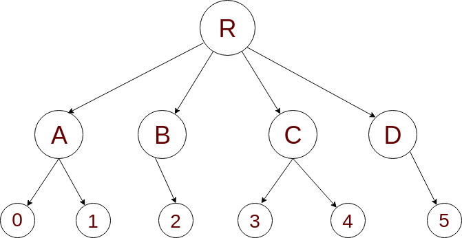

Suppose that a part of the data changes. What we want React to do is re-render only the components that are directly affected by that specific change. Possibly skip even the differentiating process for the rest of the components. Let’s say some data changes in Component `2` in the above picture, and that data has been passed from `R` to `B` and then `2`. If R re-renders then it’ll re-render each of its children that means A, B, C, D and by this process what actually React does is this:

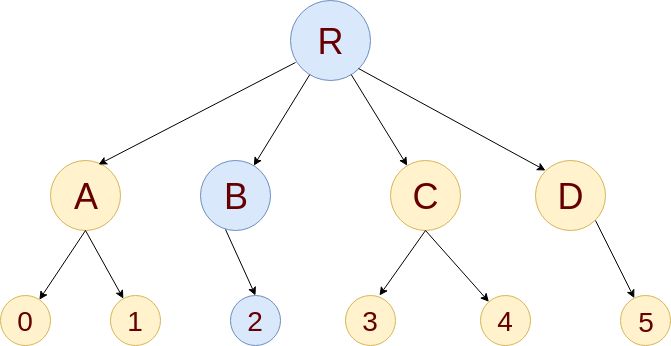

In the image above, all the yellow nodes are rendered and differentiated. This results in wasted time/computation resources. This is where we will primarily put our optimization efforts. Configuring each component to only render and differentiate when it is necessary. This will allow us to reclaim those wasted CPU cycles. First, we’ll take a look into the way that we can identify wasted renders of our application.

### Identify wasted renders

There are a few different ways to do this. The simplest method is to toggle on the _highlight updates_ option in the React dev tools preference.

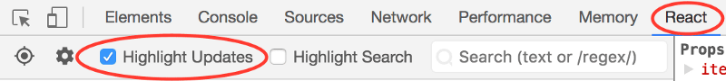

While interacting with the app, updates are highlighted on the screen with colored borders. By this process, you should see components that have re-rendered. This lets us spot re-renders that were not necessary.

Let’s follow this example.


Note that when we’re entering a second todo, the first ‘todo’ also flashes on the screen on every keystroke. This means it is being re-rendered by React together with the input. This is what we are calling a “wasted” render. We know it is unnecessary because the first todo content has not changed, but React doesn’t know this.

Even though React only updates the changed DOM nodes, re-rendering still takes some time. In many cases, it’s not a problem, but if the slowdown is noticeable, we should consider a few things to stop those redundant renders.

### Using shouldComponentUpdate method

By default, React will render the virtual DOM and compare the difference for every component in the tree for any change in its props or state. But that is obviously not reasonable. As our app grows, attempting to re-render and compare the entire virtual DOM at every action will eventually slow the whole thing down.

React provides a simple lifecycle method to indicate if a component needs re-rendering and that is, `shouldComponentUpdate` which is triggered before the re-rendering process starts. The default implementation of this function returns `true`.

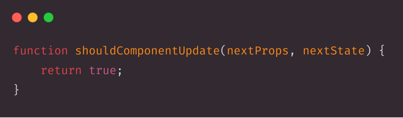

When this function returns true for any component, it allows the render differentiating process to be triggered. This gives us the power of controlling the render differentiating process. Suppose we need to prevent a component from being re-rendered, we need simply to return `false` from that function. As we can see from the implementation of the method, we can compare the current and next props and state to determine whether a re-render is necessary:

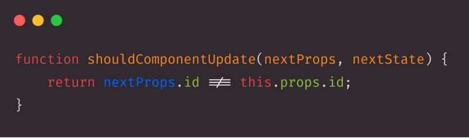

### Using pure components

As you work on React you definitely know about `React.Component` but what’s the deal with `React.PureComponent`? We’ve already discussed shouldComponentUpdate lifecycle method, in pure components, there is already a default implementation of, `shouldComponentUpdate()` with a shallow prop and state comparison. So, a pure component is a component that only re-renders if `props/state` is different from the previous _props_ and _state_.

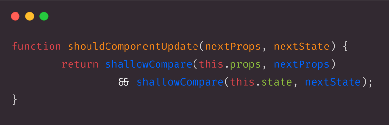

> In shallow comparison, primitive data-types like string, boolean, number are being compared by value and complex data-types like array, object, function are compared by reference

But, what if we have a functional stateless component in which we need to implement that comparison method before each re-rendering happens? React has a Higher Order Component `React.memo`. It is like `React.PureComponent` but for functional components instead of classes.

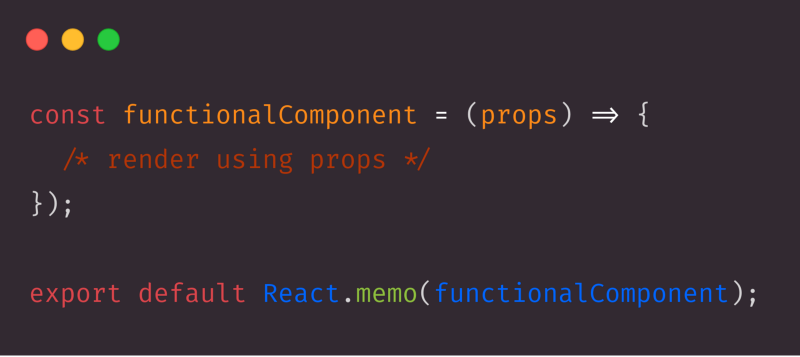

By default, it does the same as shouldComponentUpdate() which only shallowly compares the props object. But, if we want to have control over that comparison? We can also provide a custom comparison function as the second argument.

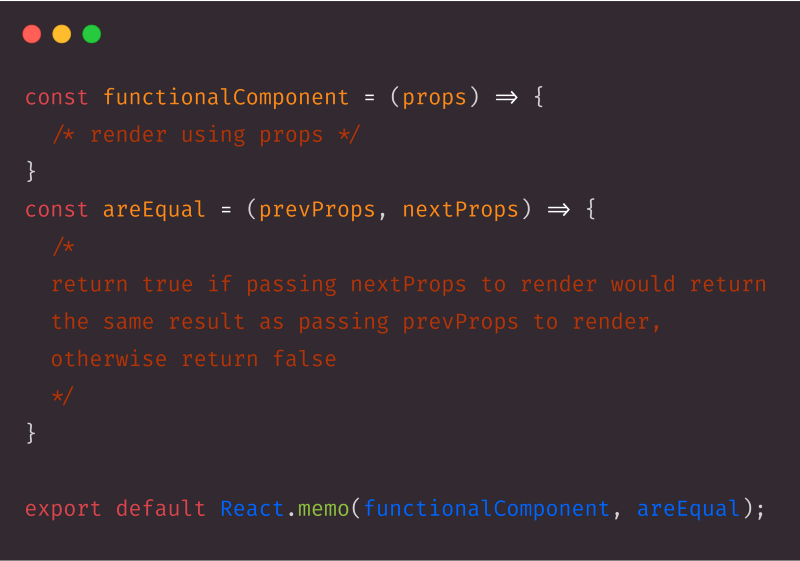

### Making Data Immutable

What if we could use a `React.PureComponent` but still have an efficient way of telling when any complex props or states like an array, object, etc. have changed automatically? This is where the immutable data structure makes life easier.

The idea behind using immutable data structures is simple. As we’ve discussed earlier, for complex data-types the comparison performs over their reference. Whenever an object containing complex data changes, instead of making the changes in that object, we can create a copy of that object with the changes which will create a new reference.

ES6 has object spreading operator to make this happen.

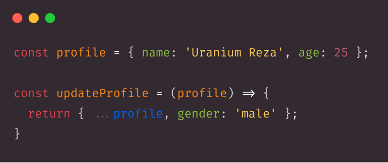

We can do the same for arrays too:

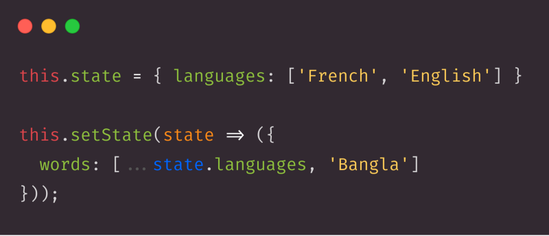

### Avoid passing a new reference for the same old data

We know that whenever the `props` for a component changes, a re-render happens. But sometimes the `props` didn’t change. We write code in a way that React thinks it did change, and that’ll also cause a re-render but this time it’s a wasted render. So, basically, we need to make sure that we’re passing a different reference as props for different data. Also, we need to avoid passing a new reference for the same data. Now, we’ll look into some cases where we’re creating this problem. Let’s look at this code.

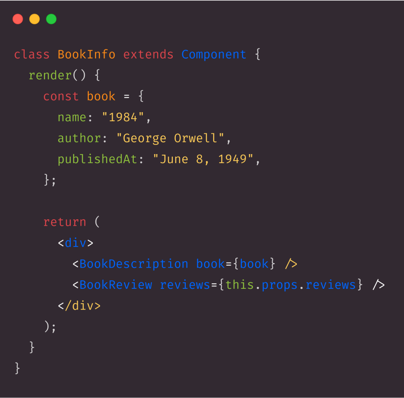

Here’s the content for the `BookInfo` component where we’re rendering two components, `BookDescription` and `BookReview`. This is the correct code, and it works fine but there is a problem. `BookDescription` will re-render whenever we get new reviews data as props. Why? As soon as the `BookInfo` component receives new props, the `render` function is called to create its element tree. The render function creates a new `book` constant that means a new reference is created. So, `BookDescription` will get this `book` as a news reference, that’ll cause the re-render of `BookDescription`. So, we can refactor this piece of code to this:

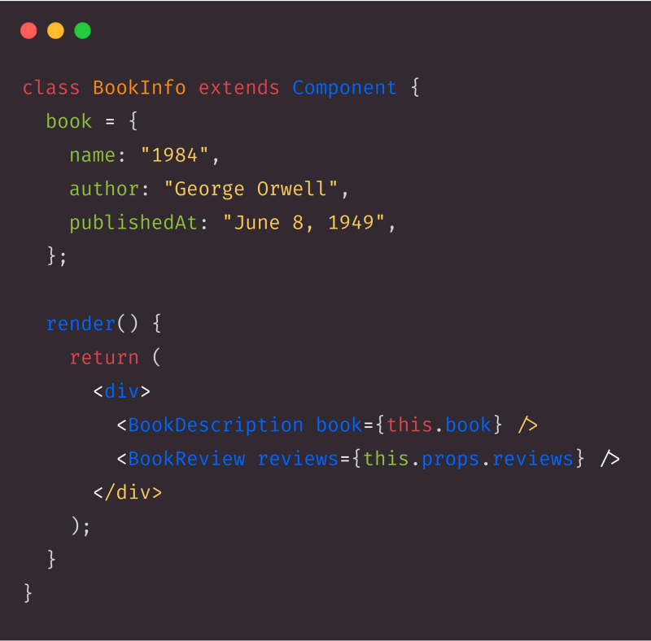

Now, the reference is always the same, `this.book` and a new object isn’t created at render time. This re-rendering philosophy applies to every `prop` including event handlers, like:

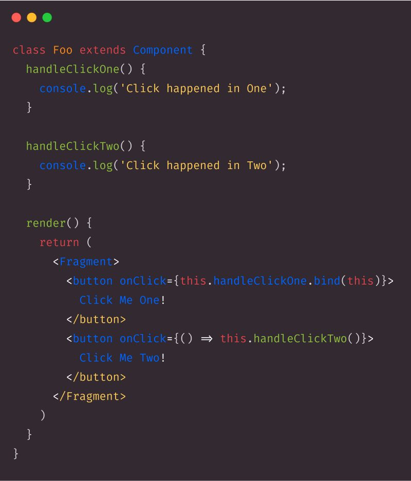

Here, we’ve used two different ways (binding methods and using arrow function in render) to invoke the event-handler methods but both will create a new function every time the component re-renders. So, to fix these issues, we can bind the method in the `constructor` and using class properties which is still in experimental and not standardized yet but so many devs are already using this method of passing functions to other components in production ready applications:

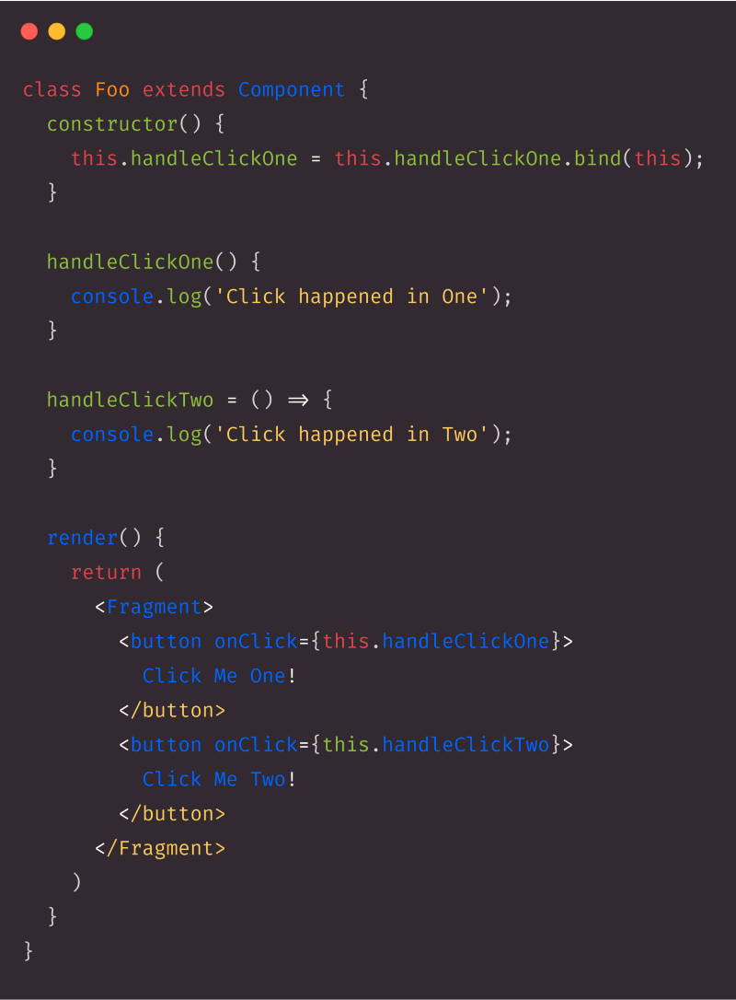

### Wrapping up

Internally, React uses several clever techniques to minimize the number of costly DOM operations required to update the UI. For many applications, using React will lead to a fast user interface without doing much work to optimize for performance specifically. Nevertheless, if we can follow the techniques I’ve mentioned above to resolve wasted renders then for large applications we’ll also get a very smooth experience in terms of performance.
