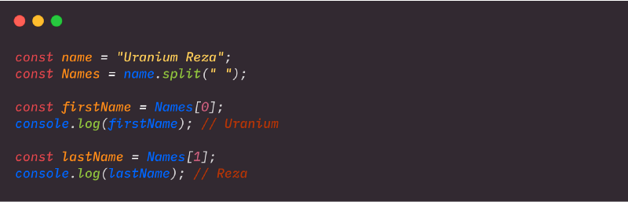
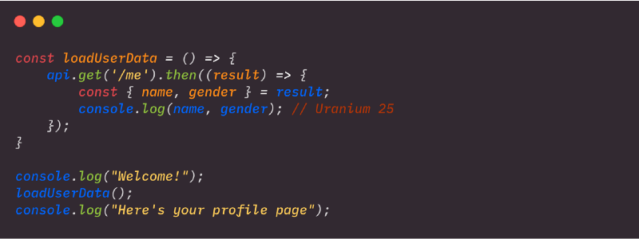
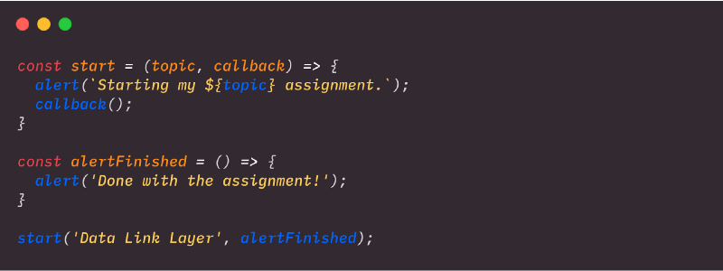

Basically, this is a super beginner level post where I want to explain few terms used in front-end development that might be alien to most of the new comers to this arena.

#### Asynchronous 

Async is short for “asynchronous”. It’s easier to understand async if we first understand what “synchronous” means. Synchronous code is executed in sequence; each statement waits for the previous statement to finish before executing. 

The statements above will execute in order i.e. showing _Uranium_ and then _Reza_ to the console. That’s because it’s written synchronously.

Asynchronous code doesn’t have to wait — it takes statements outside of the main program flow, allowing the code after the asynchronous call to be executed immediately without waiting. We write asynchronous code to keep our app responsive, reducing waiting time for the user. The typical example is an AJAX call, which might take even few seconds to finish and in the meantime we cannot block the user to do other stuffs; when the response is ready, the callback function gets called. Promises and async/await are the modern way to handle async.

Here `api.get` is an async operation. So, we’ll see “Welcome!” then “Here’s your profile page” and finally the name and gender of the user.

---

#### Callback

A callback is a function that is to be executed after another function has finished executing. In JavaScript, functions are objects. Because of this, functions can take functions as arguments, and can be returned by other functions. Functions that do this are called _Higher Order Functions_. Any function that is passed as an argument is called a callback function. We use callbacks to make sure certain code doesn’t execute until other code has already finished execution. So, we can conclude by saying —

> Forcing async code to behave synchronously is the main feature of callbacks.

Here, we’ve passed the `alertFinished` function definition as an argument during our `start()` function call! 

---

#### Scoping

Scoping is to determine where variables, functions, and objects are accessible in a codebase during runtime. In JavaScript, there are two scopes:

1.  **_Global Scope  
    _**There is only one global scope throughout a JavaScript document. A variable will be in the global scope if it’s defined outside of a function. We can access and manipulate any variable declared in a global scope from any other scope.
2.  **_Local Scope  
    _**Variables declared within a function are in the local scope. Local scope is also called function scope because local scope is created by functions in Javascript. Variables in the local scope are only accessible within the function in which they are defined i.e they are bound to their respective functions each having different scopes. This allows us to create variables that have the same name and can be used in different functions.

---

#### **Shadowing**

In JavaScript, variables with the same name can be specified at multiple layers of nested function scope (local scope). In such case local variables gain priority over global variables. If we declare a local variable and a global variable with the same name, the local variable will take precedence when we use it inside a function scope. This type of behavior is called _shadowing_. 

So, we can say the inner variable shadows the outer. This is how the JavaScript interpreter finds a particular variable; it searches for the variable at the innermost scope being executed at the time, and continues until the first match is found, even if there are other variables with the same name in the outer scope.

Another way of declaring variables with a local scope is via block functions. Before introducing `let` and `const` in ES6, we couldn’t declare local scope in block statements like `for` loops or `if` statements.

---

#### Hoisting

We already know that any variable declared within a scope belongs to that scope. But what we don’t know yet is that no matter where variables are declared within a particular scope, all variable declarations are moved to the top of their scope (global or local). This is because of a concept called **_Hoisting._**

This is a feature in which the interpreter moves all the function and variable declarations to the top of their specific  scope. It  means that variable declarations, wherever they occur, are processed before any code is executed. Important fact to note down —  hoisting only moves the declaration and not the assignment.
