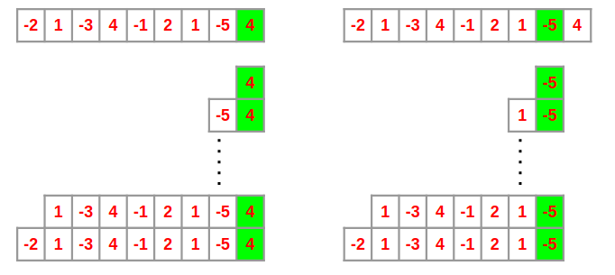
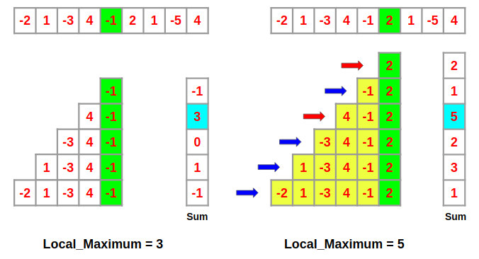

### Problem Statement

Given an integer array `nums`; find the contiguous subarray (containing at least one number) which has the largest sum and return its sum.

#### Example

```
Input: [-2, 1, -3, 4, -1, 2, 1, -5, 4]
Output: 6
Explanation: [4, -1, 2, 1] has the largest sum = 6.
```

### Solution

The naive or brute force method is to run two loops. The outer loop picks the beginning element, the inner loop finds the maximum possible sum with first element picked by outer loop which is the _localMax_ and compares this _localMax_ with the _globalMax_. And finally return the _globalMax_. This solution is pretty straight forward, right? The time complexity of this method is `O(n²)`

```C++
int maxSubArray(vector<int>& nums) {
  int size = nums.size();
  int sum = 0, maxSum = INT_MIN;

  for(int i=0; i<size; i++) {
    sum = 0;
    for(int j=i; j<size; j++) {
      sum += nums[j];
      if(maxSum < sum) maxSum = sum;
    }
  }

  return maxSum;
}
```

But we might notice that this is not a very good method because as the size of array increases, the number of possible subarrays increases rapidly, thus increasing computational complexity. Or to be more precise, if the size of the array is n, then the time complexity of this solution is O(n²) which is not very good.

How can we improve this? There is an algorithm named `Kadane's Algorithm` to solve this problem in an efficient way. To better understand Kadane’s Algorithm; first, we would go through a short introduction of _Dynamic Programming_. So, let’s get into it.

---

#### Dynamic Programming

Dynamic Programming is a method for solving a complex problem by breaking it down into a collection of simpler subproblems, solving each of those subproblems just once, and storing their solutions using a memory-based data structure (array, map, etc.); so, the next time the same sub-problem occurs, instead of recomputing its solution, one simply looks up the previously computed solution, thereby saving computation time.

Though there’s more to dynamic programming, we would move forward to understand the Maximum Subarray Problem.

---

We would use the brute force approach discussed above again, but this time we would start backward. We would start from the last element and calculate the sum of every possible subarray ending with the element _A[n-1]_, as shown in the figure below. Then, we would calculate the sum of every possible subarray ending with _A[n-2]_, _A[n-3]_ and so on up to _A[0]_.



Now let’s focus on the subarrays ending with the element _A[4] = -1_ and _A[5] = 2_ shown in the figure below.



From the figure above, we see that the _localMax[4]_ is 3 which is the sum of the subarray [4, -1]. Now let's have a look at the subarrays ending with _A[5]_. We’ll notice that these subarrays can be divided into two parts, the subarrays ending with _A[4]_ (highlighted with yellow) and the single element subarray A[5] (in green).

Let’s say somehow we know the _localMax[4]_. Then we see that to calculate the _localMax[5]_, we don’t need to compute the sum of all subarrays ending with _A[5]_ since we already know the result from arrays ending with _A[4]_. Note that, if array [4, -1] had the maximum sum, then we only need to check the arrays highlighted with the red arrows to calculate _localMax[5]_. And this leads us to the principle on which Kadane’s Algorithm works.

> localMax at index _**i**_ is the maximum of _**A[i]**_ and the sum of _**A[i]**_ and _**localMax**_ at index _**i-1**_.

```
localMax[i] = max(A[i], A[i] + localMax[i-1])
```

This way, at every index i, the problem splits down into finding the maximum of just two numbers, _A[i]_ and _(A[i] + localMax[i-1])_. Thus the maximum subarray problem can be solved by solving these sub-problems of finding _localMaxs_ recursively. Also, note that _localMax[0]_ would be _A[0]_ and that's the base case.

```C++
int maxSubArray(vector<int>& nums) {
  int size = nums.size();
  vector<int> localMax(size);
  int globalMax = localMax[0] = nums[0];

  for(int i=1; i<size; i++) {
    localMax[i] = max(nums[i], localMax[i-1] + nums[i]);
    if(localMax[i] > globalMax) globalMax = localMax[i];
  }

  return globalMax;
}
```

Using this method, we need to iterate through the array just once, which is just a line sweep and obviously a lot better than our previous brute force approach. Time complexity of this algorithm is `O(n)` and space complexity is `O(n)` too.

Here, we can optimize the space complexity by taking _localMax[i-1]_ which is the previous sum into a single variable _localMax_ i.e. eliminating the _localMax_ vector. It'll minimize the space complexity down to `O(1)`.

```C++
int maxSubArray(vector<int>& nums) {
  int size = nums.size();
  int globalMax = localMax = nums[0];

  for(int i=1; i<size; i++) {
    localMax = max(nums[i], localMax + nums[i]);
    if(localMax > globalMax) globalMax = localMax;
  }

  return globalMax;
}
```

### Follow up

We have figured out the `O(n)` solution, let's try coding another solution using the divide and conquer approach.

Using Divide and Conquer approach, we can find the maximum subarray sum in `O(nlogn)` time. Following is the Divide and Conquer algorithm:

1. Divide the given array in two halves
2. Return the maximum of following three
   - Maximum subarray sum in left half
   - Maximum subarray sum in right half
   - Maximum subarray sum such that the subarray crosses the midpoint

```C++
int maxCrossingSum(int arr[], int l, int m, int h)
{
	int sum = 0;
	int left_sum = INT_MIN;
	for (int i = m; i >= l; i--) {
		sum = sum + arr[i];
		if (sum > left_sum) left_sum = sum;
	}

	sum = 0;
	int right_sum = INT_MIN;
	for (int i = m+1; i <= h; i++) {
		sum = sum + arr[i];
		if (sum > right_sum) right_sum = sum;
	}

	return left_sum + right_sum;
}

int maxSubArraySum(int arr[], int l, int h)
{
  if (l == h) return arr[l];
  int m = (l + h) / 2;

  return max(maxSubArraySum(arr, l, m),
        maxSubArraySum(arr, m+1, h),
        maxCrossingSum(arr, l, m, h));
}
```

We are making _maxSubArraySum_ function to calculate the maximum sum of the subarray in an array. Here, we are calling the function _maxSubArraySum_ for both the left and the right subarrays i.e. recursively checking the left and the right subarrays for the maximum sum of a subarray.

Now, we have to handle the third case i.e. when the subarray with the maximum sum contains both the right and the left subarrays (containing the middle element). We will now make a function called _maxCrossingSum_ to calculate the maximum sum of the subarray crossing the middle element and then call it inside the _maxSubArraySum_ function.

Here, we are covering all three cases mentioned above and then just returning the maximum of these three. Now, let's write the _maxCrossingSum_ function which is simple but trickier; we just have to iterate over the right and the left sides of the middle element and find the maximum sum.

Here, our first loop is iterating from the _middle_ element to the _lowest_ element of the left subarray to find the maximum sum and similarly the second loop is iterating from the _middle+1_ element to the _highest_ element of the subarray to calculate the maximum sum of the subarray on the right side. And finally, we are returning the sum of this two.
