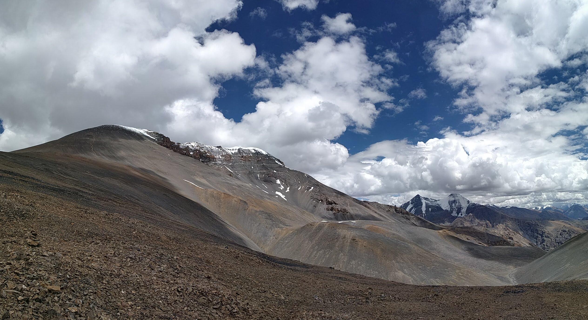
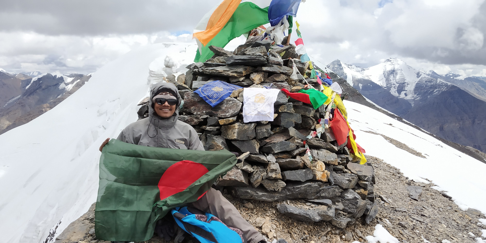

২০১৫/১৬ সালের দিকে সালেহিন ভাইয়ের _“প্রজেক্ট হোয়াইট লেডি”_ শীর্ষক মাউন্ট কানামো _(৫৯৬৪ মি.)_ এক্সপিডিশন এর রিপোর্ট পড়েই মনের মধ্যে বীজ পুতেছিলাম; যেদিন হাই অল্টিটিউড ট্রেকিং করবো, কানামো সামিট করা হবে আমার প্রথম লক্ষ্য। এবারে জীবন আমাকে একটু ছুট্টি দিল; আর অনভিজ্ঞ আমার মন বললো, “চল যাই।” কাছের বন্ধুদের কাউকে সাথে না পেয়ে শেষে একাই রওনা হচ্ছি হিমাচলের দিকে, শুভ্র নারীর কোলে। এক্সপিডিশনের সাক্সেস ক্রাইটিরিয়া হচ্ছে মাউন্ট কানামোর সামিটে পৌঁছে আবার সুস্থভাবে ফিরে আসা। মনোবলের বাইরে বাকিটা প্রকৃতি আর আমার কাঁধ, হাত-পা সর্বোপরি শরীর জানে।

২৫ জুলাই রাত তিনটায় বেইজক্যাম্প থেকে ট্রেক করা শুরু করি, হেডল্যাম্প আর টর্চের আলোর দুলকি নাচের তালে তালে চলতে থাকি দু’জন; আমি আর আমার গাইড টাশি। ঠিক সাড়ে সাতটায় পৌঁছে যাই কানামোর মেইন রিজলাইনের আগের সমতল জায়গাটায়, যেখান থেকে বামে \`কানামো\` আর ডানে \`চৌ চৌ কাঙ ন্যাল্ডা\` কে দুচোখ ভরে দেখতে পাচ্ছিলাম। ওখানে বসে ব্রেড আর স্নিকারস দিয়ে নাশতা সেরে নিলাম। তারপরেই শুরু হলো কঠিন যাত্রা। এমন খাড়া একটা জিনিস সেখানে আমার বডি-ওয়েট ৮৭ কেজি আর তার সাথে যোগ হয়েছে ছোট ছোট নুড়ি পাথর যা আমার পা বারেবার পিছলে দিচ্ছিল। পরে টাশি শিখিয়ে দিল কিভাবে পা ফেললে এই ঘটনা থেকে মুক্তি মিলবে। একরকম ঠেলতে ঠেলতে চলতে থাকলাম; দশ কদম উঠে দুই মিনিট বসে থাকি। আইস প্যাচ ঘন হওয়া শুরু হলো যেখান থেকে, তখন আমার আর শক্তি-দম কিছুই নাই! টাশি শুধু বলতেছে, “আব কুছ দম নিকালো জি, থোরাসাই তো হে”। এমন ঠান্ডা বাতাস ওই শেষটায়, ওর মধ্যে একবার বসে বসে ঘুমায় ও গেছিলাম; টাশির “চলো চলো জি” ডাকে চোখ খুললাম। শেষে জার্মান ট্রেকার সেগ্যুই এর পাশ দিয়ে যাবার সময় বলে যাওয়া, “Now that’s not your body; it’s completely upto your mind”, কথা মেনে নিয়ে নিজেকে পুশ করতে থাকি। যারপরনাই ১২ঃ১৬ এ মাউন্ট কানামোর সামিটে (৫৯৬৪ মি.) পৌঁছে যাই। সামিট পয়েন্টের পাথরের স্তূপায় হেলান দিয়ে কানে ইয়ারফোন গুঁজে মেঘদল এর পাথুরে দেবী আর Sigur Rós ভাইদের Glósóli, Popplagið শুনতে শুনতেই দেখি আধা-ঘন্টা চলে গেছে! এবেলা নামতে থাকি; বেইজক্যাম্পে গিয়ে ব্যাকপ্যাক-তাবু সব গুছিয়ে নিয়ে কিবেরের উদ্দেশ্যে হাঁটা শুরু, বিকেল ৫ঃ৫০ এ কিবের চলে আসি।

---

🙏 OM MANI PAE MEY HUN 🙏
