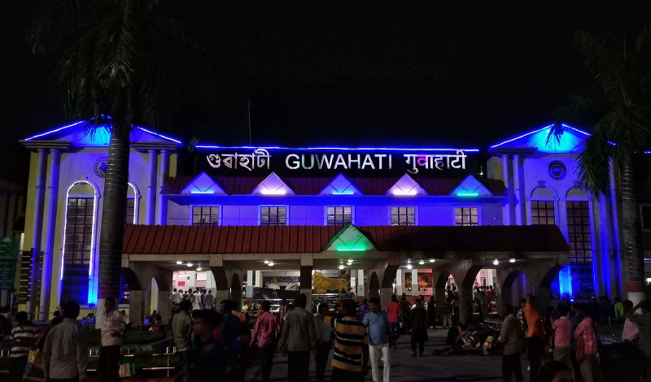

বাংলাদেশ থেকে তিন বন্ধু ভারতের উদ্দেশ্যে যাত্রা শুরু করি ১৭ জুন রাত ১২ঃ১০ এর বাসে; উদ্দেশ্য নাগাল্যান্ডের জুকো উপত্যকা। ঢাকা থেকে সিলেট জনপ্রতি বাস-ভাড়া ছিল ৪৭০টাকা। সিলেট পৌঁছুই ঠিক ঠিক সকাল ৬টায়। আমাদের ইচ্ছে হলো সকালের নাশতা টা পাঁচ-ভাই রেস্টুরেন্টে করে তারপরে রওনা হই; তো সবাই রাজি, সিএনজি করে পাঁচ ভাই গিয়ে রুটি-পরোটা দিয়ে পেট পূজা শেষ করে আবার ফিরে এলাম সিলেট বাস-টার্মিনালে। এখান থেকে জাফলং এর বাসে চেপে বসলাম, তখন সময় সকাল ০৭:৪০, তামাবিল স্থলবন্দর হয়ে বাসটি জাফলং যাবে; তামাবিল নেমে একটু হেঁটে গেলেই বাংলাদেশ-ভারত বর্ডার। মাত্র ৫২ কি.মি. রাস্তা পাড়ি দিতে আমাদের ঠিক ঠিক আড়াই ঘন্টা সময় লাগলো! অপ্রত্যাশিত জ্যাম আর বাজে রাস্তার কারণে এত দেরি।

যাইহোক, ১০টার মধ্যে পৌঁছিয়েও আমরা মোটামুটি খুশি; কেননা বর্ডারে ইমিগ্রেশন-কাস্টমস অফিস তাদের কাজ শুরু করে ৯টা থেকে। কিন্তু খুশির স্থায়িত্ব বেশিক্ষণ ছিলনা, ইমিগ্রেশন অফিসে গিয়ে মাথায় রীতিমত বাজ পড়লো; বিশাল লম্বা লাইন। তারমধ্যে আরও মজার ব্যাপার হচ্ছে আমরা ট্রাভেল ট্যাক্স ঢাকা থেকে দিয়ে যাইনি, ওখানে গিয়ে দেয়া যায় বলে! ইমিগ্রেশনে ট্রাভেল-ট্যাক্স দিতে গেলাম; ৫০০টাকার ট্রাভেল ট্যাক্স এর জায়গায় আমাদের দিতে হল ৭০০টাকা করে। এবং বিনিময়ে কোন সরকারি স্লিপ দেয়নি, শুধু একটা টুকরা কাগজে হাতে লিখে দিল নাম-পাসপোর্ট নাম্বার। সেই নিয়েই গেলাম কাস্টমস অফিসে, কাস্টমস অফিসার সব কথার প্রথম কথা বলেই ফেললেন, “তিনজনের ১০০ করে ৩০০ দেন।” চুপচাপ ৩০০টাকা দিয়ে বাংলাদেশের ইমিগ্রেশন-কাস্টমসের কাজ শেষ করি ঘড়িতে তখন ১১:৫০। এর মাঝে একটু গুড়িগুড়ি বৃষ্টি হয়ে গেছে প্রায় ঘন্টা দেড়েক, আকাশ এমনিতেও সকাল থেকে বেশ মেঘলা ছিল। আমাদের সাথে প্রত্যেকেরই রেইনকোট ছিল, তাই তেমন একটা অসুবিধে হয়নি।

ভারতের ইমিগ্রেশনে ঢুকে এবেলা সত্যিই অবাক হবার পালা; ছোট্ট একটা ঘর এর মধ্যে মানুষজন ঘিঞ্জি হয়ে কেউ দাঁড়িয়ে, কেউ বসে সময় কাটাচ্ছে। এমন একজনের সাথে কথা হলো যিনি কিনা প্রায় ২ঘন্টা আগে পাসপোর্ট জমা দিয়েছেন কিন্তু এখনও কোন খোঁজ মেলেনি। এই ডাউকি ইমিগ্রেশন অফিসের প্রত্যেকটা কাজ ম্যানুয়ালি হাতে-কলমে হয়, নেই কোন কম্পিউটার। ইয়া বড় একটা রেজিস্টার খাতার মধ্যে আপনার নাম-পাসপোর্ট নাম্বার-এরাইভাল ডেট এসব লিখে আপনার সাক্ষর নিবে, একই রকম কাজ ইমিগ্রেশন-কাস্টমস দু’জায়গাতেই। এগুলো করতে করতে দুইটা বেজে গেছে; এবং বলে রাখি ইতিমধ্যে আমরা নিজ-নিজ ঘড়ি আঁধা ঘন্টা পিছিয়ে মিলিয়ে নিয়েছি ভারতের সময়ের সাথে।

ডাউকি ইমিগ্রেশন অফিস থেকে ট্যাক্সি নিয়ে জনপ্রতি ২০রূপি করে ডাউকি বাজারে গিয়ে পৌঁছুলাম। সেই সকালের পাঁচ-ভাইয়ের খাবারটুকুই এখনও পেটে রয়েছে; ১০রুপি করে জনপ্রতি দুইটা কলা কিনে খেয়ে নিয়ে আমাদের দুপুরের খাবারের পর্ব সমাপ্ত করলাম। এর মধ্যেই শিলংগামী ক্যাব খুঁজতে লাগলাম, আর অন্য বন্ধু আমাদের বাংলাদেশি টাকাগুলোকে ভারতের রূপিতে কনভার্টের জন্য দোকানে দোকানে ঘুরতে থাকলো। ০.৭৮ কনভার্সন রেটে রূপি নিলাম আমরা; এর মধ্যে ২১০০ রূপিতে একটা মারুতি ক্যাবও মিলে গেলো আমাদের। যাত্রা শুরু মেঘালয়ের রাজধানী শিলং এর উদ্দেশ্যে।

পাহাড়ি আঁকাবাঁকা রাস্তা ধরে ছুটছে আমাদের গাড়ি, পাশ দিয়ে ঠান্ডা বাতাস গাড়ির জানলা দিয়ে মুখের উপরে আলতো পরশ বুলিয়ে দিয়ে যাচ্ছে; ইমিগ্রেশনের ক্লান্তিকর সময় শেষে মেঘালয়ের মেঘ এর রাজ্য যেনো আমাদের ঠান্ডা-নরম আদর ছুঁইয়ে বরণ করে নিচ্ছে। পেছনের সিটে তাকিয়ে দেখি দুই-বন্ধু শান্তির ঘুম ঘুমুচ্ছে। ভারতে আমি আগেও একটা বিষয় লক্ষ্য করেছি, তা হলো পান-মসলা খাওয়া, এর মধ্যে নিকোটিন ও থাকে। ওদের সিগেরেট এর প্রতি তেমন একটা আগ্রহ নেই দেখলাম। সারাদিন কিছুক্ষণ পরপর হাতের তালুতে একটু করে মসলা প্যাকেট থেকে ঢেলে নিবে আর অন্যহাতের বৃদ্ধাঙ্গুলি দিয়ে কিছুক্ষণ মর্দন করে নিয়ে ওইটা টুপ করে মুখে ঢুকিয়ে ফেলবে! আমাদের গাড়ির ড্রাইভার ভাই এর নাম ছিল নির্মল, মাঝে একটা জায়গায় গাড়ি থামালো সে এই পান-মসলার প্যাকেট কিনবে বলে; সেখানে আমরা মম আর সেদ্ধ ডিম খাই। ডাউকি থেকে শিলং এর ৮২ কিলোমিটার পাহাড়ি আঁকাবাঁকা রাস্তা অতিক্রম করতে আমাদের সময় লেগে গেলো প্রায় আড়াই ঘন্টা। ৫টার দিক করে আমরা শিলং পৌঁছুই। এখান থেকে যেতে হবে আসামের রাজধানী গুয়াহাটিতে।

যেহেতু আমাদের গুয়াহাটি থেকে রাত ১১:৩৫ এর নাগাল্যান্ড-এক্সপ্রেস ট্রেন ধরবার প্ল্যান সেই কথা মাথায় রেখে শিলং এ দেরি না করে আরেকটা ক্যাব ঠিক করলাম ১৪০০ রূপিতে, শিলং থেকে গুয়াহাটির ৯৮ কিলো রাস্তা পাড়ি দেয়ার জন্যে। গাড়িতে উঠেই আমাদের প্রথম কাজ ছিল, নিজেদের ফোন গাড়ির সাউন্ড-সিস্টেমের সাথে ব্লু-টুথে কানেক্ট করে গান শোনা শুরু করা। ওইদিকে ক্লান্তি মাথায় নিয়ে সন্ধ্যের নিভুনিভু আলোয় রেডিওহেড শুনতে শুনতে কখন যে ঘুমিয়ে পড়েছি তার আমার কোন হদিস নেই। যখন ঘুম ভাঙলো, দেখি পেছনে বাকিরাও ঘুমুচ্ছে, আর গাড়িতে অসমীয়া ভাষায় রেডিও বাজতিছে। বাংলার সাথে এত এত মিল কথাগুলার; আমি চুপচাপ বসে শুনতে থাকলাম, মনে হলো প্রায় ৯০ভাগ কথাই আমি বুঝতেছি। এর মধ্যেই গুয়াহাটি স্টেশন পৌঁছে গেলাম; তখন বাজে রাত ৮টা। টিকিট রিজার্ভেশন কাউন্টারে গিয়ে খবর পাই নাগাল্যান্ড-এক্সপ্রেসে কোন সিট নেই। একটু চিন্তায় পরে গেলাম; কাউন্টারে আবার জিজ্ঞেস করলাম —

> “আমরা বিদেশি তো, বাংলাদেশ থেকে এসছি। ট্যুরিস্ট কোটায় টিকিট মিলবে?”

এই পর্যন্ত সব কথাই হচ্ছিলো ইংলিশে; হঠাৎ করে আমার বাংলাদেশ শব্দ শুনে কাউন্টারে বসা পাতলা গোঁফওয়ালা, শ্যামবর্ণের, একটু মোটুসটু লোকটা বাংলায় বলতে লাগলো —

> “বাপু তোমরা জেনারেলে টিকিট করে নাও, বসার জায়গা পেয়ে যাবে, আর ভাগ্য ভাল থাকলে তো দেখবে এক স্টেশন পরেই শোবার জায়গা হয়ে যাচ্ছে।”

এই কথা বলে যে সুন্দর একটা মুচকি হাসি দিলেন, আমার খুব আনন্দ হলো। তো, আমাদের হাতে জেনারেল টিকিট ছাড়া আর কোন অপশন নেই। গুয়াহাটি — দিমাপুর এর তিনটা জেনারেল টিকিট কিনে ফেললাম ২৭০ রূপিতে। এখন ট্রেনের জন্যে অপেক্ষা করবার পালা; কিন্তু সারাদিন তো পেটে ভারী কিছু পড়েনি। তাই, ভাত খাবো ঠিক করে স্টেশন থেকে বের হয়ে আসলাম; এক রিকশাওয়ালা কাকুকে খাবার দোকানের কথা জিজ্ঞেস করাতে সে পাল্টা প্রশ্ন করে যে, আমরা কি সিম্পল খাবার খেতে চাই নাকি ভাল খাবার। আমরা বলি সিম্পল খাবার। সে আমাদের বলে,

> “চলো আমি তোমাদের এমন এক হোটেলে নিয়ে যাবো, তোমরা খুশি হয়ে যাবে ওখানকার খাবার খেয়ে; এবং পরেও গুয়াহাটি আসলে এখানে খেতে আসবে।”

নাম তার বিজয় হোটেল। ছোট্ট একটা ঘর, সেখানে ৫টা টেবিল পাতা রয়েছে, পরিবেশটা অন্যরকম। বন্ধু মঈন একটা সুন্দর উপমা দিয়েছে বিজয় হোটেল নিয়ে, তা হল —

> থ্রি ইডিয়টস সিনেমাতে রাজুর বাসায় ওর মা রুটি বানায় ওই সিনটার কথা মনে আছে? ওখানে পুরা ফ্রেম সাদাকালো হয়ে যায়না? বিজয় হোটেলে ঢুকবার পরেও এইরকম একটা অনুভূতি হয়, চারপাশ সাদাকালো ফিল্টারে ছেয়ে গেছে।

সেখানে ৫৫ টাকায় সবজি, ডাল, ভাত, আলু ভাজা, ডিম মামলেট, পাপর, লেবু, পেঁয়াজ দিয়ে গলা পর্যন্ত ভর্তি করে নিয়ে এবার হেঁটে হেঁটেই ফিরে এলাম স্টেশনে।

ওয়েটিং-রুমে বসে সময় কাটালাম সাড়ে এগারোটা পর্যন্ত, এখনও আমাদের কাছে ইন্ডিয়ান কোন সিম না থাকায় এক রকম নেটওয়ার্কের ভেতরে থেকেও আমাদের পরিবারের কাছে যেনো আমরা নেটওয়ার্কের বাইরে। ট্যুরিস্ট সিম ম্যানেজ করতে হলে এজেন্টরা হেল্প করতে পারেনা, সেক্ষেত্রে আমাকে যেতে হবে টেলিকম অপারেটরের স্থানীয় অফিসে। কিন্তু সারাদিন মোটামুটি দৌড়ের উপরে থেকে এটা আর করা হয়ে উঠেনি। ট্রেনের সেকেন্ড ক্লাস বগিতে উঠে বসে পড়লাম। সারাদিনের টানা জার্নির পরে গুয়াহাটি থেকে দিমাপুরের এই ২৩৮ কি.মি. রাস্তা এভাবে বসে বসে ঘুমিয়ে কাটাতে হবে ভেবেই একটু কষ্ট লাগছিল। না-গা-ল্যা-ন্ড ভ্রমণের প্রথমদিন নাগাল্যান্ড এক্সপ্রেসে এসেই শেষ হলো। সারারাত ট্রেনের ঝিকঝিক ঝিকঝিক সুরের মধ্যে আমরা পরম ক্লান্তির ঘুম দিই ট্রেনের সিটে বসে বসেই, আর স্বপ্ন দেখি আগামী দিনের…

[**নাগাঞ্চি যাত্রা : পর্ব ২**  
_…নাগাল্যান্ড এক্সপ্রেসে যখন সকাল হলো; তখন সময় সকাল ৫টা। ট্রেনে বসে বসে এমন ক্লান্তির ঘুম ঘুমিয়েছি যে দিন-দুনিয়ার আর কোন…_medium.com](https://medium.com/tripsharebd/%E0%A6%A8%E0%A6%BE%E0%A6%97%E0%A6%BE%E0%A6%9E%E0%A7%8D%E0%A6%9A%E0%A6%BF-%E0%A6%AF%E0%A6%BE%E0%A6%A4%E0%A7%8D%E0%A6%B0%E0%A6%BE-%E0%A6%AA%E0%A6%B0%E0%A7%8D%E0%A6%AC-%E0%A7%A8-1ef6bb61e86b "https://medium.com/tripsharebd/%E0%A6%A8%E0%A6%BE%E0%A6%97%E0%A6%BE%E0%A6%9E%E0%A7%8D%E0%A6%9A%E0%A6%BF-%E0%A6%AF%E0%A6%BE%E0%A6%A4%E0%A7%8D%E0%A6%B0%E0%A6%BE-%E0%A6%AA%E0%A6%B0%E0%A7%8D%E0%A6%AC-%E0%A7%A8-1ef6bb61e86b")
