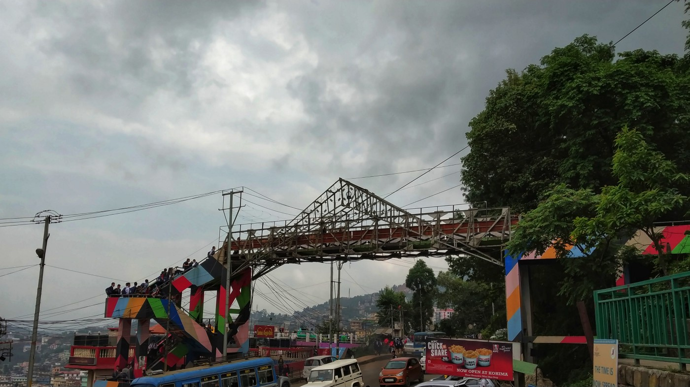

…নাগাল্যান্ড এক্সপ্রেসে যখন সকাল হলো; তখন সময় সকাল ৫টা। ট্রেনে বসে বসে এমন ক্লান্তির ঘুম ঘুমিয়েছি যে দিন-দুনিয়ার আর কোন হদিস ছিলনা। ডিমাপুর স্টেশনে নেমেই ওয়েটিং-রুমের খোঁজে হাঁটা দিলাম। ওয়েটিং রুমে ফ্লোর ভর্তি মানুষজন ঘুমুচ্ছে তখন। আমরা চুপচাপ ওয়াশরুম থেকে ফ্রেশ হয়ে নিয়ে স্টেশন থেকে বাইরে আসি। শরীরে হালকা ব্যথা অনুভব করছিলাম, আর ঘুমও যথেষ্ট অপূর্ণ হয়েছিল।

ডিমাপুর স্টেশনের ঠিক বাইরেই এন.এস.টি (নাগাল্যান্ড স্টেট ট্রান্সপোর্টেশন) স্টেশন। ওখানে গিয়ে কোহিমার জন্যে বাসের টিকিট করলাম ৩০০রূপি খরচ করে। ছ’টায় বাসের ইঞ্জিন স্টার্ট নিলো; চল্লিশ সিটের বাসের একেবারে শেষ তিনটি সিট, মানে ৩৮, ৩৯ আর ৪০ আমাদের ভাগ্যে জুটেছিল। তখনও বুঝে উঠতে পারিনি যে সামনে কি ভয়াবহ সময় অপেক্ষা করছে আমাদের জন্যে।

ডিমাপুর থেকে কোহিমার চার-লেন ন্যাশনাল হাইওয়ের কাজ চলছিল। এমন ধূলোভর্তি বাজে রাস্তা দেখে আমার মিরপুরের রাস্তার কথা মনে পড়ে গেলো। ক্লান্তিতে একটু একটু চোখ বুজে আসছিল, কিন্তু বাসের পেছনে রোলার কোস্টারের মতন এলোমেলো লাফালাফিতে একবার সামনে তো আরেকবার পাশের জানলায় ধাক্কা খেয়ে ঘুম ভেঙ্গে যাচ্ছিল। আবার চোখ বুজে নিয়ে সামনের সিটে মাথা হেলিয়ে ঘুমাবার চেষ্টা করতে থাকলাম।

দু’ঘন্টা পর বাস যাত্রাবিরতির জন্যে থামলো, পাহাড়ি রাস্তার ধারঘেষে কয়েকটা ছোট ছোট খাবার হোটেল আর কয়েকজন ফেরিওয়ালা পাহাড়ি শাক-সবজি-ফল বিক্রি করছে। আমাদের কারোরই তখন খাবার তেমন ইচ্ছে হলোনা। আশপাশ হেঁটে বেরুলাম আর বাজারের জিনিসপত্র দেখতে থাকলাম। এত সুন্দর বোম্বাই মরিচ আমি কখনও দেখিনি, প্যাকেট ভর্তি বোম্বাই মরিচ কিনতে হবে বিধায় আর কেনা হলোনা; নয়তো আমি এক-দুইটা সত্যিই সাথে করে নিয়ে আসতাম। এর মধ্যে মঈন, একটা লালচে-বেগুনি রঙের ফল হাতে নিয়ে গন্ধ শুঁকে জিজ্ঞেস করে, “এইটা কি ফল?” উত্তর আসে, “প্লন”। অনেকক্ষণ কথাবার্তা বলেও নামটা ঠিক করে বুঝে উঠতে পারলাম না! কিন্তু ফল খেতে তো আর ফলের নাম বুঝবার প্রয়োজন নাই; এক প্যাকেট প্লন কিনে নিয়ে এক কামড় দিতেই মনে হলো প্রথমে আপেল খাচ্ছি, একটু পরেই মনে হলো টক আঙুর এর মতন স্বাদ। আরেক কামড় খেয়ে এবার মিষ্টি-কুমড়ার গন্ধ পেলাম। এমন আজব ফল খেয়ে আমরা রীতিমত তাজ্জব বনে গেছি; কিন্তু যেটা খেয়াল করলাম তা হলো এই ফল আপনি একসাথে দুইটার বেশি খেতে পারবেন না। প্লনভর্তি প্যাকেট নিয়ে হেসে-খেলে আবার গিয়ে বাসের পেছনে বসলাম। শুরু হলো আবার রোলার-কোস্টার রাইড।

হঠাৎ বাসের জানলা দিয়ে দূরে পাহাড়ের গা ঘেষা একটা শহর চোখে পড়লো; এই সেই শহর কোহিমা, নাগাল্যান্ডের রাজধানী। কিছুক্ষণের মধ্যেই বাস গিয়ে কোহিমা এন.এস.টি স্ট্যান্ডে থামলো। বাস থেকে নেমে এদিক-ওদিক তাকাতে একটা অদ্ভূত অনুভূতি হলো, এর আগে ফেলে আসা শিলং বা গুয়াহাটি শহর থেকে এর সবকিছুই অনেক অনেক ভিন্ন। রাস্তার ফরমেশন, মানুষজন, দোকানপাট, ঘর-বাড়ির ধরণ এমনকি ভাষা!

সকালের নাশতার খোঁজে হাঁটা ধরলাম; এদিক-ওদিক করে শেষমেশ দু’তলার একটা ছোট্ট রেস্টুরেন্টে গিয়ে আলু-পরোটা, ডিম-মামলেট আর ডাবলির ডাল (অনেকটা চটপটির মতন স্বাদ) দিয়ে সকালের নাশতা শেষ করলাম, খরচ হলো ১৮০টাকা।

এবার থাকার জায়গা বন্দোবস্ত করবার পালা। কোহিমায় আপনি হোটেল বললে মানুষজন ভাববে খাবার হোটেল; আর থাকার জায়গাকে ওরা লজ বলে। সুতরাং, লজিং দেখা শুরু হল। আমাদের ইচ্ছে ছিল আর যাই হোক না কেনো ওয়াইফাই ওয়ালা লজ ম্যানেজ করতে হবে, নেটওয়ার্কের ভেতরে যাওয়া দরকার, দেশের মানুষজন এখনও জানেনা যে আমরা সাত-সমুদ্দুর, তের-নদী পাড়ি দিয়ে নাগাঞ্চি চলে আসছি।

খুঁজে খুঁজে আমাদের মন-মতন লজ মিললো; অরোরা লজ! শুধু লবিতে ওয়াইফাই আছে; তাই রুমে না গিয়ে লবিতে বসে দিন-দুনিয়াকে জানানোর পর্ব শেষ করলাম। একে একে গোসলে গেলাম, ডিমাপুর-কোহিমার রাস্তার ধূলো সারা গায়ে লেগে সবার চেহারা একরকম হলুদাভ হয়েছিল।

দু’জনকে হোটেলে রেখে একটা ইন্ডিয়ান সিম কেনা যায় কিনা তার জন্যে একাই বেরিয়ে পড়লাম। হোটেলের আশেপাশে কয়েকটা দোকানে কথা বলে যেটা বুঝা গেলো, আমার সিম কিনতে হলে টেলিকম অপারেটরের অফিসে যেতে হবে। কোহিমাতে ভোডাফোন আর এয়ারটেল এর অফিসে গিয়ে কথা বলায় দুই জায়গা থেকে দুইরকম উত্তর আসে। ভোডাফোনের আপুরা বলেন, “আপনি পাসপোর্ট দিয়ে সিম নিতে পারবেন; কিন্তু সেক্ষেত্রে একজন লোকাল রেফারেন্স লাগবে! মানে ইন্ডিয়াতে থাকেন আপনার কোন ফ্রেন্ড বা ফ্যামিলি!” জবাবে জিজ্ঞেস করলাম, “আমি একজন ট্রাভেলার, আমার তো ইন্ডিয়াতে পরিচিত কেউ না থাকাটাই স্বাভাবিক, তাহলে কি আমি সিম পাবোনা?” আপুরা বললো যে তারা ঠিক এই ব্যাপারটার সমাধান করতে পারছেনা! অন্যদিকে এয়ারটেলের অফিসের ভাইয়া বলেন, “পাসপোর্ট দিয়ে সিম কিনলে সেটা এক্টিভেট হতে সময় লেগে যাবে এক সপ্তাহ!” মনে মনে বলছিলাম, “আমি তো এক সপ্তাহ আছি কিনা তার ঠিক নাই!” আরও বললো, “আধার\* কার্ড দিয়ে কিনতে পারলে ভাল হয়; কিন্তু আপনি যেহেতু ট্যুরিস্ট সেক্ষেত্রে আপনার তো আধার কার্ড নেই।” তার সাথে একটু মজার ছলে বললাম, “তাহলে ঘটনা কি দাঁড়ালো?” সে এমন একটা লুক দিলো, আমি মুচকি হেসে ধন্যবাদ বলে হোটেলে ফিরে এলাম।

হোটেলের লবিতে বসে রিসিপশনে বসা ভাইয়ের সাথে গল্প জুড়ে দিলাম; আর আমার সিম কেনার একরকম দৌড়ঝাপের কথা শুনে তিনি বিষয়টা আমলে নিলেন। একটু পরে হোটেলের এসিস্ট্যান্ট ম্যানেজার এর সাথে কথা বলে তিনি আমাকে বললেন, “একটা উপায় আছে, আর তা হলো আমার আধার কার্ড দিয়ে একটা সিম কিনে সেটা আপনাকে দেয়া। আপনি ব্যবহার করলেন, আর যখন বাংলাদেশে ফিরে যাবেন তখন আমি সিম হারানোর এপ্লিকেশন করে আবার সিমটা তুলে নিবো। যদিও ব্যাপারটা একটু রিস্কি, বুঝতেই তো পারছেন? তবে আপনারা আমাদের গেস্ট, এইটুকুন আমি করবোই।” তার কথা শুনে আমরা তিনজন খুবই খুশি হলাম। একটু পরে সিম নিয়ে আসলেন, বিনিময়ে আমাদের গুণতে হলো ৩৩০ রূপি। এর মধ্যে ২২৯ রূপিতে একটা প্যাকেজ কেনা হয়েছে যেখানে পরবর্তী ২৮ দিনের জন্যে প্রতিদিন ১.৪জিবি ফ্রি ডাটা আর সকল লোকাল কল ফ্রি! আমরা তো আরও খুশি; কারণ আমাদের মূলত ডাটা দরকার, আরও নির্দিষ্ট করে বললে গুগল ম্যাপ্স!

সে যাই হোক, সিম পেয়ে খুশিমনে ফোনের কানেক্টিভিটি নিয়ে বেরিয়ে পড়লাম শহর ঘুরতে। শুরুতে প্ল্যান ছিল কোহিমা শহরের ভেতরেই টুকটাক ঘুরে-ফিরে দেখবো। এখানকার ল্যান্ডস্ক্যাপ আমাদের দেশের চেয়ে অনেক ভিন্ন হবার কারণে যা দেখছিলাম সবই ভাল লাগছিল। মঈন একটু হতাশ, সে এরকম র‍্যান্ডম ঘুরাফেরা পছন্দ করছিল না। কি আর করা, গুগল কাকুর সহায়তায় সিদ্ধান্ত নিলাম আমরা খনোমা ভিলেজ যাবো। তখন বাজে দুপুর ৩টা, কোহিমা থেকে খনোমা যেতে আমাদের পাড়ি দিতে হবে ২০কি.মি. রাস্তা। হ্যাকার মাইন্ডসেটে হুটহাট করে ক্যাব ঠিক করে নিলাম; ক্যাবের ড্রাইভার ভাই নাম তার আলম, সেও কখনও খনোমা ভিলেজ যায়নাই, এমনকি রাস্তাও ক্লিয়ারলি চেনেনা। আমরা তাকে সাহস দিলাম এই বলে যে, আমাদের কাছে ম্যাপ আছে! সে রাজি হয়ে গেলো ১০০০ রূপিতে কোহিমা-খনোমা-কোহিমা পর্যন্ত আমাদের সাথে নিয়ে রাইড দিতে।

এক-ঘন্টা সময় লাগলো খনোমা পৌঁছুতে; যাবার পথটা একটু বাজে হলেও চারপাশের সৌন্দর্য্য সেটাকে একটু হলেও প্রশমিত করেছিল। খনোমার একটু আগে এক জায়গায় লেখা দেখলাম, “ Welcome to Khonoma, first ever green village in Asia!” ক্যাব থেকে যেখানে নামলাম, গ্রামের এন্ট্রি পয়েন্ট; সেখানে বিশাল একটা চার্চ। তার পাশ ধরে হেঁটে যেতে যেতে মনে হলো টুপ করে যেনো কেউ আমাদের সবুজের রাজ্যে ফেলে দিয়ে গেলো। এত পরিষ্কার-পরিচ্ছন্ন চারপাশ; আর এত এত ফুলের গাছ প্রতিটা বাড়িতে এমনকি রাস্তার পাশেও! তখন গ্রিন ভিলেজ কথাটার মর্মার্থ বুঝলাম। যেহেতু বেশ বিকেল করে আমরা খনোমা পৌঁছুই তাই ঠিক একরকম তাড়াহুড়ো করেই গ্রামটা একবার চক্কর দিয়ে ফেলি। খনোমাতে ঢুকতে নিয়েই আপনার চোখে পড়বে একটা লম্বা হাতে আঁকা ম্যাপ; সেখানে গ্রামের প্রতিটা কমিউনিটি স্পেস এর উল্লেখ আছে। আমরা গ্রামের শেষ প্রান্তে যে সরাইখানা রয়েছে ওখানে গিয়ে খাওয়া-দাওয়া করবো বলে ঠিক করি।

গ্রামের মূল রাস্তা ধরে হাঁটতে হাঁটতে একপাশে থাকা ধাপে ধাপে জুমক্ষেতের দৃশ্যে চোখ ডুবিয়ে অন্যদিকে গ্রামের এ বাড়ি, ও বাড়ি দেখতে দেখতে পৌঁছে গেলাম দোভিপাই ইন; সেখানে গিয়ে খাবার অর্ডার করে আমরা এদিক-ওদিক ঘুরে দেখছিলাম। সরাইখানার ছাদে গেলাম; ওইখানে আমাদের সঙ্গ দেয়ার জন্যে সরাইখানার একজন ইনচার্জ ও আমাদের সাথে গেলেন; একটা গোলমতন টেবিলের চারপাশে চেয়ারে বসে আমরা একথা-ওকথা বলতে বলতে খনোমা’র ইতিহাস, সংস্কৃতি এসব নিয়ে কথা হলো। মুরং এর কথা শুনলাম তার কাছ থেকেই। মুরং হচ্ছে গ্রামের পাঠশালার মতন; গ্রামের মুরুব্বিরা তাদের গ্রামের ইতিহাস, তারা কিভাবে যুদ্ধ করতো তা সম্পর্কে আসর করে যুবকদের গল্প বলে মুরং এর সামনে বসার জায়গাতে। গ্রামের দুর্গ গুলো অন্যান্য বাড়িগুলো থেকে অনেকটাই ভিন্ন, সম্পূর্ণ পাথরের তৈরী এক একটা দূর্গ। ভেতরে মজুদ আছে যুদ্ধ করবার সরঞ্জামাদি। আমাদের একরকম আফসোস হচ্ছিল, মনে হলো কোহিমায় রাতে না থেকে এখানেই থাকা উচিত ছিল। আশপাশ ঘুরেফিরে আরও শান্তি করে খনোমার সৌন্দর্য উপভোগ করা যেতো।

কথা বলতে বলতেই আমাদের খাবার তৈরী হয়ে গেলো। ছাদ থেকে নিচে নেমে ডাইনিং রুমে বসে খাবার খেয়ে নিলাম; নাগা চাটনি, মুরগীর ঝাল ফ্রাই আর ড্রাই পর্ক ফ্রাই দিয়ে চারজন দুই বল ভাত খেলাম, খরচ হলো মাত্র ৮০০ রূপি। সারাদিনে প্রথমবারের মতন ভারি কিছু খাবার পরে একটু শরীরটা এলিয়ে দিতে ইচ্ছে হলো। কিন্তু ওইদিকে সন্ধ্যে নেমে আসছে, ফিরতে হবে। বলে রাখা ভালো, কোহিমাতে সন্ধ্যা ৭টার পরে কিছুই খোলা থাকে না। সব দোকানপাট বন্ধ; শুধু পাহাড়ের খাজে খাজে বাড়ির মধ্যে আলোগুলোকে যেনো একঝাক জোনাকির মতন মনে হয়।

আলম ভাইয়ের সাথে আমাদের কথা হয়েছিল এরকম যে আমরা খনোমাতে এক ঘন্টা থাকবো। কিন্তু অলরেডি দুই ঘন্টা হয়ে গেছে, সে ও তেমন কিছু বলছে না। কারণ, তারও খনোমাতে এটা প্রথমবার; সে একরকম মুগ্ধ চারপাশ ঘুরেফিরে।

এবার ফেরার পালা; ঘড়িতে সময় সোয়া ছয়টা, হালকা অন্ধকার নেমে আসছে চারদিকে। গাড়ির হেডলাইট জ্বালিয়ে দিয়েছেন আলম ভাই। তার পাশে বসে কথা বলছিলাম; তার পরিবারের কথা, তার বাচ্চাদের কথা, তার গ্রামের কথা। পেছনের সিটে দু’জন ক্লান্ত হয়ে ঘুমুচ্ছে। আলম ভাই আমাদের অরোরা’র সামনেই ড্রপ করে দিলেন। পুরা শহর মনে হলো ঘুমিয়ে গেছে, কোনদিকে কোন দোকানপাট কিচ্ছু খোলা নাই।

হোটেলে ফিরে ফ্রেশ হয়ে নিয়ে আমরা টাকা-পয়সার হিসেব নিয়ে বসলাম; পরেরদিনের প্ল্যান গুছিয়ে নিলাম। একফাঁকে কয়েকপিঠ তাস পিটানোও হয়ে গেলো। সবশেষে টিভি খুলে ইজিপ্ট আর রাশিয়ার খেলা দেখতে দেখতে সবাই ঘুউউম।
