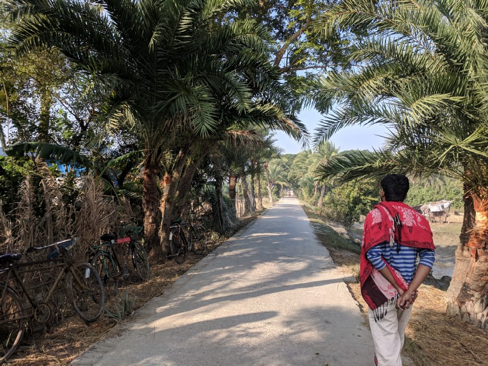

সুদূর নেদারল্যান্ড থেকে দেশে আসছেন ইমরান ভাই; আসবার আগে থেকেই নিঝুম দ্বীপ যাবার প্ল্যান এর কথা বললেন। অনেকদিন এই করুণ নেক্রোপলিস ছেড়ে কোনদিকে ডুব দেয়া হয়না বলে, এক কথায় রাজি হয়ে গেলাম। ঠিক করা হলো ২১ তারিখ বিকেলের লঞ্চে হাতিয়ার উদ্দেশ্যে রওনা হবো আমরা। আশপাশের মানুষজনকে ডাকাডাকি করে শেষমেশ সাথে মিলল ইব্রাহিম ভাই আর বন্ধু নওশাদ কে। আগে থেকে জানা ছিল, সদরঘাট থেকে ফারহান ৩ এবং ৪ নামক দুইটা লঞ্চ হাতিয়া যায়। ২০ তারিখ সন্ধ্যায় ফারহান ৩ এর সুপারভাইজার মেহদী ভাইকে কল করে বিকাশে ১০২০ টাকা পাঠিয়ে বুক করে ফেললাম একটা ডাবল কেবিন। বিকেল সাড়ে ৫টায় ছেড়ে যাবে ফারহান — ৩; এর আগে আগেই যার যার কর্মস্থল থেকে সবাই সদরঘাট টার্মিনালের পন্টুন ৯ এ উপস্থিত, সামনে ফারহান — ৩। কলা, পানি আর ইমরান ভাইয়ের নিয়ে আসা রুটী — গ্রিল নিয়ে লঞ্চে উঠলাম। কেবিনে ঢুকে দেখি ছোট্ট একটা ঘরের মধ্যে দুইটা বেড সাথে আবার একটা টিভি; সাকিব খানের ছবি দেখানো হবে সন্ধ্যার পরে বলে জানা গেল।

লঞ্চ একটু দেরি করলেও ছ’টার আগে করেই ছেড়ে দিল। হঠাৎ আবিষ্কার করলাম, কেবিনের মধ্যে কোন আলো নাই; একটা বাতিও জ্বালাতে আমরা সক্ষম হলাম না। পরে লঞ্চের ইলেক্ট্রিশিয়ান কে ডেকে এনে নতুন বাল্ব লাগানো হলো; আলোয় ঝকঝক করা কেবিনে বসে ইমরান ভাইয়ের আনা গ্রিল আর রুটি দিয়ে আমরা একটু করে পেট-পূজা সেরে নিলাম। এর মধ্যেই সন্ধ্যে নেমে আসলো নদীর মাঝে; বুড়িগঙ্গার নোংরা পানি পেছনে ফেলে যাচ্ছি একটু একটু করে।

ইতোমধ্যে আমাদের নজরে পড়েছে যে মাথার উপরে ইয়া বড় একটা চাঁদ আছে। লঞ্চের ডেক হয়ে ছাদে যাবার চেষ্টা করলাম চাঁদটাকে আরও কাছ থেকে দেখবার আশায়। কিন্তু আপার ডেকে গিয়ে দেখি ছাদে উঠার সিঁড়ি ওরা কেটে ফেলে রাখছে! সুতরাং ছাদে উঠা গেলোনা আর। কেবিনে বসেই রাতের খাবার খেয়ে নিলাম। ভাত, আইর মাছ, কোরাল মাছ আর ডাল চচ্চড়ি। এত্তগুলা ভাত খেয়ে মনে হলো টুপ করে ঘুমায় যাই। কেবিনের বাইরে বারান্দায় তখন ঠান্ডা বাতাস; গল্প করতে করতে ইলিশ্যা ঘাটে লঞ্চ ভিড়লো। আমি, ইমরান ভাই আর ইব্রাহিম ভাই ভাবলাম ঘাটে নেমে চা খেয়ে আসা গেলে মন্দ হয়না। ভেবে আর কাজ নেই বলে নেমেই গেলাম। একটা টঙ এ বসে তিনজন লাল চা খাচ্ছি আর জীবন নিয়ে কথা বলছি। ইমরান ভাই এর মধ্যে একবার আমাকে বললেন, লঞ্চ যদি ছেড়ে দেয় তো কী হবে? আমি তাকে আশ্বস্ত করলাম এই বলে যে, ছাড়ার আগে অবশ্যই সাইরেন বাজাবে। হঠাৎ ঘাটের দিকে তাকায় দেখি লঞ্চ নড়াচড়া করতেছে; দোকানদার কাকুকে জিজ্ঞেস করলাম লঞ্চ কিরকম সময় থাকে এই ঘাটে; বললেন, লঞ্চ তো ছেড়ে যাচ্ছে। আমি আর ইব্রাহিম ভাই দিলাম দৌড়। এর মধ্যে লঞ্চ অনেকখানি দূরে চলে গেছে ঘাট থেকে। গলায় যতটুকু শক্তি ছিল তা দিয়ে চিল্লাপাল্লা করে লঞ্চের মানুষজনের দৃষ্টি আকর্ষণের চেষ্টা করলাম। লঞ্চ আবার ঘাটে ভিড়লো, আমরা তিনজন উঠলাম; বিনিময়ে মিললো একগাদা মানুষের ঘ্যানঘ্যানানি। দোষ যেহেতু আমাদেরই, তাই চুপচাপ মাথা নিচু করে তিনতলায় কেবিনে চলে গেলাম! নওশাদ তখন কেবিনে এক পশলা ঘুম দিয়ে উঠছে; তার সাথে পুরা ঘটনা শেয়ার করার পরে তার কমন ডায়লগ, “পারছো তো দাদা!”

> এই ট্যুরের একটা মজার ব্যাপার হচ্ছে, সবাই সিএস পড়া মানুষ এবং সবাই সফটওয়্যার ইন্ডাস্ট্রিতে জব করে। এর কারণে যেটা হইছে, জীবন নিয়ে কথা বলার ফাঁকতালে আমরা সিএস রিলেটেড কথাবার্তাও টুকটাক চালায় যাই; এই ব্যাপারটা ভাল ছিল।

সকালে ৭টার দিক করে লঞ্চ হাতিয়া তমরদ্দি ঘাটে পৌঁছুলো। আগে থেকে জানা ছিল, এখান থেকে সিএনজি/বাইকে করে আমাদের জাহাজমারা ঘাটে যেতে হবে। যেহেতু কেবলই লঞ্চ এসে ভিড়লো সেহেতু কোন সিএনজি এবং বাইকওয়ালা ভাইদের চেহারার দিকে ঠিক করে তাকানো যাচ্ছিলোনা তাদের ঊর্ধ্বমুখী ভাড়া চাইবার নমুনা দেখে। তাই আমরা একটু দেরি করবার জন্যে ঘাটের পাশেই একটা হোটেলে ঢুকে পরোটা, ডিমভাজি আর ডাল-ভাজি দিয়ে নাশতা করে ফেললাম। এর মধ্যে দু’জন বাইকওয়ালা ভাই সেই প্রথম থেকে যে আমাদের পিছু নিয়েছে তারা আর পিছু ছাড়ছেনা। আমরাও একরকম কাদার মাছের মতন পিছলা হয়ে সেই যে ৩০০টাকায় যাবো বলেছি তার থেকে একটা টাকাও বাড়াতে রাজি হচ্ছি না। শেষমেশ ওই দুই ভাই আমাদের নিয়ে চললেন জাহাজমারা ঘাটের উদ্দেশ্যে।

আমার খুব বাজে একটা অভ্যাস হলো, যেকোন যানবাহনে উঠলেই চোখ বুজে আসে, সেটা বাইক হোক আর রিকশা; বাস হলে তো কথাই নেই! নওশাদ পেছনে বসলো, আমি মাঝে। কিছুক্ষণ পরেই খেয়াল করলাম আমি ঝিমুচ্ছি। ড্রাইভার ভাই একবার জিজ্ঞেস করলেন, ভাই ঘুমান ক্যান? আমি উত্তরে বললাম, “ভাই ঘুমাই না। বাতাস লাগে চোখে তাই চোখ বন্ধ করে রাখছি।” আসলে আমি তখন শতভাগ ঘুমে পানি হয়ে আছি। এই পথটার একটা অংশ ভালো; বাকি অংশটা কাচা রাস্তা এবং খুবই বিচ্ছিরি রাস্তা। ওই ভাঙাচোরা রাস্তার মধ্যেও আমি খুব আরামের ঘুম দিলাম; হে হে হে!

জাহাজমারা ঘাটে পৌঁছে ইমরান ভাইদের বাইকের জন্যে অপেক্ষা করছি; তারা তখনও এসে পৌঁছায়নি। আমি আর নওশাদ ঘাটের পাশে বসে হালকা ফটোসেশন করে নিলাম এই ফাঁকে। জাহাজমারা ঘাট থেকে ট্রলারে নদী পার হতে হয়; ভাড়া ৩ টাকা। আবার ওপারে গিয়ে বাইকে চড়ে নিঝুম দ্বীপ নামার বাজারে। এখানের রাস্তা হাতিয়ার তুলনায় অনেক ভাল। বাজারের আশপাশে বেশ কিছু হোটেল আছে থাকার জন্যে। হোটেল অবকাশের নাম আমরা আগে থেকে জানতাম। ওখানেই একটা রুম ঠিক করা হলো চারজনের জন্যে। বেলা প্রায় তখন সাড়ে এগারোটা।

সবাই হালকা করে ফ্রেশ হয়ে নিয়ে দুপুরের খাবার সন্ধান চলল। একটা হোটেলে ঢুকে তাদের সবরকম মাছ একবেলায় পেটপুরে খেয়ে একটা নৌকা ঠিক করে ঘুরতে যাবার প্রস্তুতি নিতে থাকলাম। অনেকক্ষণ ধরে কথা হওয়া একজনের নৌকা ঠিক হল।

নৌকা ঘাটের একটু আগে একটা ফরেস্ট অফিসের ওয়াচ — টাওয়ার আছে; ছয় তলা উঁচু। ওর উপর থেকে নিঝুমদ্বীপের একপাশের সাগর আর দুইপাশের নদী খুব সহজে খালি চোখেই দেখা যায়। সবচেয়ে সুন্দর ব্যাপারটা হচ্ছে উপর থেকে দেখা ম্যানগ্রোভ বন — সবুজ আর সবুজ, একরাশ জীবনীশক্তি আছে যেন এর মাঝে; আমি ডুব দিলেই গায়ে মেখে যাবে। ঘাটের একটু পাশেই একটা বেশ সমতল জায়গা আছে বনের ধারঘেষে; ওখানে বেশ কয়েকটা তাবু পাতা আছে। হোটেলে না থেকে এখানেও থাকা যায় চাইলে; রাতের ঠান্ডা বাতাসকে রীতিমতো ভয় করেই তাবুতে থাকার ইচ্ছেকে বিদায় জানিয়ে হোটেলে থাকার সিদ্ধান্ত নেই আমরা। ওখান থেকে আরেকটু সামনে এগিয়ে গেলেই একটা জায়গা যেখানে নৌকা মেরামত আর নতুন নৌকা বানানোর কাজ চলছিল। ওখানেই আমরা নিঝুম দ্বীপে আসার পরে প্রথম হরিণটা দেখে ফেললাম; একটা পোষা হরিণ।

  

নৌকা ঘাটে এসে নৌকায় চড়লাম সবাই; নৌকা চলা শুরু করলো। আমাদের গন্তব্য চৌধুরী খাল; তারপরে কমলার দ্বীপ এবং সবশেষে কবিরাজ চড়। নদীর ঠান্ডা বাতাস সূর্যের তাপটাকে একেবারেই পাত্তা দিচ্ছিলনা। গায়ে দেয়া একটা পাতলা টিশার্ট আর উইন্ড ব্রেকারেই সুন্দর কাজ চলছিল। নদীর ধার ধরেই নৌকা চলছিল; পাশে পলি-মাটি জমে জমে একটা বড় সমতল জায়গার তৈরী হয়েছে; ওই মাঠে আবার ছোট ছোট ঘাস জন্মিয়ে পুরো এলাকাটা দেখে মনে হচ্ছিল যেন বিশাল একটা সবুজ ফুটবল খেলার মাঠ। শেষবার যখন এসছিলাম তখনকার স্মৃতি মনে পড়লো, শেষ বিকেলের আলোয় এই সবুজ মাঠের কাদায় গড়াগড়ি করে বলিখেলা আর নদীর পানিতে বন্ধুদের সাথে গোসল করা। সবুজ মাঠ জুড়ে মহিষের পাল আর বিভিন্ন রকমের পাখি চোখে পড়লো; পাখিদের নাম জানা নেই বলে একটুখানি আক্ষেপ হলো, এমনকি খালি চোখে ওদের ভাল করে দেখতে পাইনা বলে আরও কষ্ট বাড়লো। হঠাৎ হঠাৎ অনেকগুলা পাখি এখান থেকে ওখানে উড়ে যাচ্ছে; মাঝে আবার নৌকার পাশ দিয়ে একঝাক ছোট ছোট মাছেদের লাফানো দেখলাম। এই দৃশ্যগুলো আমার মনে বেশ দাগ কেটেছে; আমার ঘুরতে যাবার উদ্দেশ্য একমাত্র এই ব্যাপারগুলোই। এইযে আমার মনে একটা নতুন দৃশ্য যুক্ত হলো; এই ঘটনাটা আমি খালি চোখে যদি কখনও না দেখতাম তবে কি আমি এর কিছুটা হলেও কখনও কল্পনা করতে পারতাম? আমাদের কল্পনা শক্তি অনেক তীব্র; তারপরেও একটা রেফারেন্স পয়েন্ট লাগে; যার জন্যেই আমার দেশে-বিদেশের এখানে ওখানে ঘুরে বেড়াতে, নতুন নতুন মানুষদের সাথে কথা বলতে, তাদের জীবন নিয়ে জানতে ভাল লাগে!

 

চৌধুরী খাল দিয়ে নৌকা একটু একটু এগিয়ে যাচ্ছে; ছবিতে দেখা সুন্দরবন আর এখানকার মধ্যে খুব একটা পার্থক্য করা যায় না। দুইধারে এত্ত এত্ত শ্বাসমূল আর ভেতরে এলোমেলো লাইন ধরে দাঁড়িয়ে থাকা কেওড়া গাছ। একটু এগিয়ে নৌকা সাইড করলে আমরা বনের ভেতরে যাবো বলে নেমে পড়ি। বনে হাঁটতে গিয়ে যেই জিনিসটা খুব সহজেই চোখে পড়বে তা হচ্ছে হরিণের পায়ের ছাপ.. বনের মধ্যে হরিণের পাল দেখবো ভেবে আমরা একটু এক্সাইটেড ছিলাম। কিন্তু কমলার দ্বীপে হরিণ দেখবো বলে এই বনে বেশি সময় না ব্যয় করে আবার নৌকায় উঠে পড়ি।

চৌধুরী খাল থেকে কমলার দ্বীপ একটুখানি দূরেই বলা চলে; ট্রলারে প্রায় ঘন্টাখানেক সময় লেগে যায়। কমলার দ্বীপে যখন পৌঁছলাম; জায়গাটা দেখেই মনে হলো এখানে সচরাচর মানুষের পা পড়েনা, আসার পথেও অন্য কাউকে আসা-যাওয়া করতে দেখলাম না এবং আমরা যতক্ষণ ছিলাম অন্য কোন মানুষেরও দেখা মিলেনি। বনের মধ্যে নিজেদের সব শব্দ বন্ধ করে বসে থাকলে বনের নিজের অনেকগুলা শব্দ মিলে যে অদ্ভুত সুন্দর মিউজিক কানে আসে এই ব্যাপারটা খুবই শান্তির। মনে হবে যেন এভাবে ঘন্টার পর ঘন্টা এই পরিবেশে চুপ হয়ে বসে থাকা সম্ভব। খালি পায়ে মাটির ছোঁয়া লাগাবো বলে জুতা নৌকায় রেখেই নেমে পড়েছিলাম; ব্যাপারটা যে খুব একটা বুদ্ধিমানের কাজ হয়নি তা বুঝতে পেরেছি একটু পরেই। শ্বাসমূল ছড়িয়ে আছে সবখানে সাথে আছে টেংরাকাটার ঝোপ। এর মধ্যে আপনি যতই সতর্কতার সাথে হাঁটেন না কেন পায়ে গুতো খাওয়া সুনিশ্চিত। সূর্যটা এর মধ্যে পশ্চিম দিকে হেলে পড়েছে; গাছের গা বেয়ে আলো বনের মধ্যে ঢুকে একটা সবুজ — হলুদ আলোর মিশ্রণ তৈরী করেছে। এই মুহূর্ত গুলো চাইলেও ক্যামেরাবন্দী করা যায়না; শুধু মনের মধ্যে শাটার টেনেই শান্তি পেতে হয়। নওশাদ আর মাঝি ভাই অনেকটা এগিয়ে গেছে; এর মধ্যে কয়েকবার ওদের কথা শুনে বুঝলাম ওরা হরিণ দেখতে পেয়েছে। আমি অবশ্য ওইদিকে খেয়াল করছিনা। আমার সবুজ-হলুদ আলো-ছায়ার খেলা দেখা আর বনের ধ্বনি শোনায় যত আগ্রহ। বনের প্রায় অনেকটা ভেতরে ঢুকে গেছি; এখানটায় আরও ঘন হয়ে আসছে গাছপালা। মাটিও একটু স্যাঁতস্যাঁতা কারণ সূর্যের আলো মাটি ছুঁইবার ফুরসৎ পায়না বলে মনে হচ্ছে। আমার এইখানে ঘুমায় পড়তে ইচ্ছে হলো; কিন্তু কখন যে সূর্য ডুবি ডুবি বলা শুরু করেছে তার দিকে আমাদের তেমন একটা নজর ছিলনা, হঠাৎ সম্বিত ফিরতেই নৌকায় ফিরতে আরম্ভ করলাম; ওই সবুজ মাঠে বসে সূর্যাস্ত দেখবো বলে। কিন্তু হিসেব-নিকেশ একটু ভুল হলে যা হয় আরকি! নৌকায় বসেই আধডুবা সূর্য দেখতে হলো। মাঝিকে বললাম সন্ধ্যে যেহেতু নেমে গেছে; চলেন আমরা নিঝুম দ্বীপ ফিরে যাই, কবিরাজ চড় পরে কখনও দেখা যাবে।

 

নদীতে অন্ধকার নেমে আসতে না আসতেই চাঁদ মামা যেনো একরকম বিদ্রোহ করেই জেগে উঠলেন সকল আঁধারকে মুক্তি দিবেন বলে। কিছুক্ষণের মধ্যেই আকাশের এক কোণায় এত্ত বড় একটা চাঁদ; নদীর পানিতে চাঁদের আলোর ঝলকানি দেখে মন ভরে গেলো। ইমরান ভাই আর নওশাদ অনেক চেষ্টা নিমিত্তি করেও খালিচোখে দেখা পুরো দৃশ্যটাকে ক্যামেরাবন্দী করতে পারলো বলে মনে হলো না। কানে ইয়ারফোন গুঁজে দিয়ে ট্রলারের ইঞ্জিনের ঘটঘট শব্দ থেকে বাঁচবার চেষ্টা করলাম। সাহানার রবীন্দ্রসংগীত আর চাঁদের আলো; ফিরতি পথটা আরও লম্বা হলেও ক্লান্ত হতাম না হয়তো। নদীতে ভাটা তখন একেবারে শেষের দিকে। খালের পানি কমে এসেছে অনেকটা। আমাদের ছোট্ট নৌকাই পানি পাচ্ছিলনা চলার মতন। তাও একটু একটু করে খাল ধরে নৌকা-ঘাটে এসে পৌঁছুলাম।

ওখান থেকে সরাসরি বাজারে গিয়ে পুরি আর বুটের ডাল (অনেকটা চটপটির মতন) দিয়ে সন্ধ্যার নাশতাপর্ব শেষ করে সাগরপাড়ের দিকে হাঁটা দিলাম। কক্সবাজার সমুদ্র সৈকতের অনেক দূর থেকে যেমন সাগরের গর্জন শোনা যায় এখানে ঠিক তার বিপরীত; অনেক দূর থেকে আপনি সাগরের শান্ত নিস্তব্ধতা অনুভব করতে পারবেন। সৈকতের ধারে বিশাল বালুর জায়গাটা পেরিয়ে হঠাৎ আমরা আবিষ্কার করলাম যে সামনে অনেক কাদা এবং সাগর আরও বেশ খানিকটা দূরে। ভাটার কারণে সাগরের পানিতে পা ভেজানো হলোনা। কিছুক্ষণ হাঁটাহাঁটি করে সবাই সিদ্ধান্ত নিলাম হোটেলে ফিরে আসবো। এখানে আসবার পর থেকে ভালোই দৌড়ের উপরে ছিলাম, রেস্ট নেয়ার মতন সময়টাও মিলেনাই একমাত্র আমার ওই বাইকে ঘুমিয়ে পড়া বাদে!

হোটেল রুমে এসে ফ্রেশ হয়েই কম্বলের ভেতরে ঢুকে পড়লাম। নওশাদ আর ইমরান ভাইয়ের খালি গলার গান আর মাঝে মোবাইলের স্পিকারে বাজানো গানের সাথে সুর মেলানো; এই করতে করতে কখন ঘুমিয়ে গেছি তার হদিস নেই। যখন ঘুম ভাঙলো তখন পরদিন সকাল সাড়ে সাতটা। এবেলা ফিরে যাবার প্রস্তুতি নেবার পালা। ব্যাগ গুছিয়ে হোটেল থেকে বের হয়েই দেখি একটা হরিণ, ও হোটেলের পেছনের ডোবায় পানি খেতে এসছিল। তারসাথে আমাদের কিছুক্ষণ সময় কাটলো; হোটেলের সবুজ ভাই (সুপারভাইজার) বললেন ওকে চিপ্স খাওয়ালে নাকি আরও অনেকক্ষণ আমাদের সাথে থাকবে। কিন্তু আমরা ওকে কিছুই খাওয়াতে পারলাম না।

 

বাজারে এসে সকালের নাশতা করে আবার ওই বাইক। মাঝে একজায়গায় বাইক থামিয়ে খেজুরের রস টেস্ট করা হয়ে গেল। সমুদ্র পাড়ের এলাকা তাই খেজুর রসেও একটু নোনতা স্বাদ। তার পর আবার বাইক — নদী পাড়াপাড় — বাইক — লঞ্চ করে ঢাকা সদরঘাট পৌঁছলাম ভোর ৫টার দিক করে। আরও একটা দিন নিঝুম দ্বীপের আলো-বাতাসে নাক ডুবিয়ে আসতে পারলে মন্দ হতোনা। এই ঠাস বুনোটের ভিড়ে ফিরে এসে আবার সেই পুরোনো মন্দলাগা অনুভূতি ভর করলো…

---

আরও কিছু ছবি

