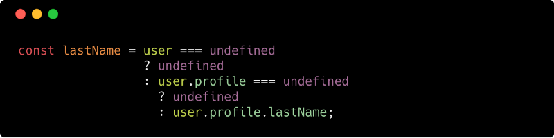

In June 2018 release of React Native [(0.56.0)](https://github.com/react-native-community/react-native-releases/blob/master/CHANGELOG.md#056) they had announced the enabling of optional chaining operator `?.` plugins. Previously we’ve to manually add _babel-plugin_ for _syntax-optional-chaining_ to use this operator. So, here comes the question; **_what is the purpose of this optional chaining operator thing?_**

### Problems in Property Chaining

We normally encounters the state where an expected member of a property chain is **undefined** or **null**. Suppose we’re getting the `data` from an _API_ call; we expect `user.profile.lastName` to exist but for some reason the `lastName` is missing from the `user` object.

Let’s see some of the existing solutions that we can use to solve this issue -

#### Try-Catch

#### Ternary Operator

#### Logic Expression

In my opinion, this procedures are bit of _Ugly_, _Noisy_, _Burdensome_ and _Verbose._ Here’s where optional chaining comes in action. We can have the fun of using it like this:

That’s much easier, right? As we’ve seen the usefulness of this feature, we can go ahead and take a deep dive.

Array index _Out of Bound_ is a common phenomena in programming world, optional chaining works for array property access too:

We can also check the existence of a function:

Expressions will not execute farther if that chain is not complete. Under the hood, the expressions is practically transformed to this:

Basically in a short we can sum up this like — nothing after the optional chain operator `?` will be executed if the value is _undefined_ or _null_. So, in a whole optional chaining reduces the need for `if` statements, imported libraries like `lodash`, and the need for chaining with `&&` logical operator.

#### Reference

Here’s one of the [link](https://github.com/TC39/proposal-optional-chaining)s of the proposal of adding optional chaining in Javascript, and this is the babel-plugin-proposal [link](https://babeljs.io/docs/en/next/babel-plugin-proposal-optional-chaining.html). Finally the commit [link](https://github.com/facebook/react-native/commit/aa6f394c4236e5a4998c3be8ed61ec1bab950775) of adding optional-chaining plugin to RN 0.56
