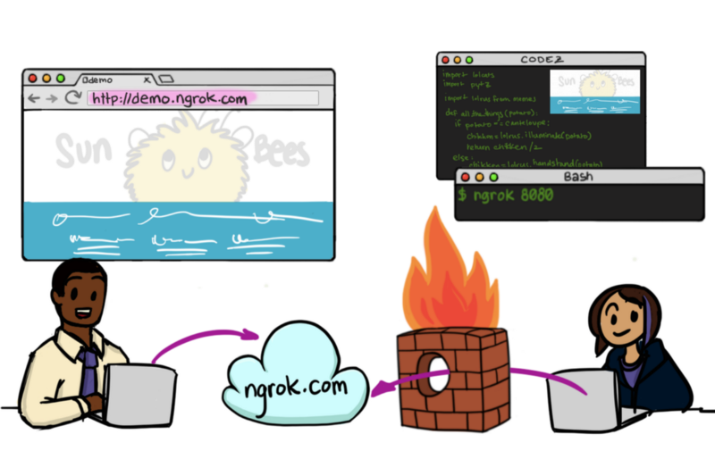
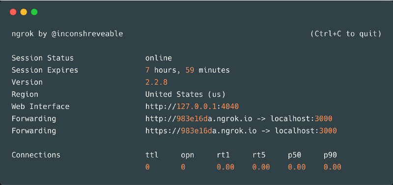
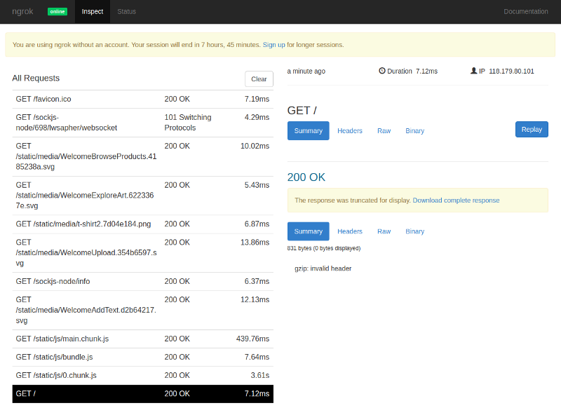
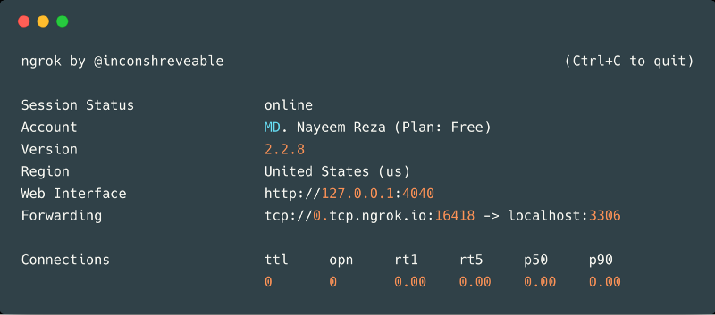

…show the world what awesome things you’re building

So, you’ve started working on a cool project and you wanna share a glimpse of that with your friends or your teammates. But, you’re running your project on _localhost i.e. 127.0.0.1_ which cannot be accessed from outside of your local network! Why’s that?



#### Why isn’t my IP public?

On the Internet, everything connected has an IP address which uniquely identifies Internet devices. IP addresses also come in two types: public and private. The public addresses are accessible to anyone on the Internet. The private addresses are only accessible to your LAN i.e. _Local Area Network_. A typical local area network is composed of a router and a number of devices connected to the router. The router is assigned a public IP address by the internet provider. Every device in the local network, including the router itself, is assigned a private IP address, usually in the form _192.168.x.x_. It will never be a public IP address, and the same IP address 192.168.1.100 exists hundreds of thousands if not millions of times all over the world. The router acts as a gateway between the home devices and the internet. This gateway performs [network address translation](https://en.wikipedia.org/wiki/Network_address_translation) (NAT) between the public and the private networks. While this allows a local device to reach a public IP address, it is usually not possible to initiate a communication from the outside.

Most public IP addresses have names, called DNS hostnames, and many private IP addresses do, too. For example, [www.google.com](http://www.google.com/) is a DNS hostname that has an IP address. If you open your terminal and type `ping www.google.com`, you will find that your computer translated that hostname to an IP address, such as 172.217.2.228. The universal hostname for `myself` on any Internet device is `localhost`, and the universal IP address for _localhost_ is the private IP address _127.0.0.1_. This address is not recognizable to your router; only your machine/pc ever _sees_ it.

---

Then how would you expose your private ip i.e. _127.0.0.1_ to the outside world so that your friends from outside of your LAN can see what’s running in your _localhost_? You can do local tunneling and share a publicly exposed link to your fellow-mates.

#### What the heck is tunneling, btw?

Tunneling is a protocol that allows for the secure movement of data from one network to another. Tunneling involves allowing private network communications to be sent across a public network, such as the Internet, through a process called encapsulation. The encapsulation process allows for data packets to appear as though they are of a public nature to a public network when they are actually private data packets, allowing them to pass through unnoticed. `Ngrok` (_en-grok_) is such kind of a tool which allows you to expose a web server or networked service running on your local machine to the internet.

whoof! tired already? Let’s see how we can do this tunneling thing.

---

#### Ngrok Setup & Installation

Ngrok is easy to install. Download a single binary with zero run-time dependencies, unzip it and run it on your terminal.

[**ngrok - download**  
\_ngrok secure introspectable tunnels to localhost webhook development tool and debugging tool_ngrok.com](https://ngrok.com/download 'https://ngrok.com/download')[](https://ngrok.com/download)

On Linux or OSX you can unzip ngrok from a terminal with the following command. On Windows, just double click ngrok.zip.

```
$ unzip /path/to/ngrok.zip
```

Then you need to connect your account (for that you need to _sign up_ and grab your _authtoken_). Running this command will add your account’s authtoken to your ngrok.yml file. This will give you more features and all open tunnels will be listed in your account dashboard.

```
$ ./ngrok authtoken <your-auth-token>
```

---

#### Expose a local webserver

Now, you’ve started a local webserver, fire up ngrok by pointing it to the port where your local server is running — *(in my case it was 3000)*

```
$ ./ngrok http 3000
```

The output will list a forwarding URL, which will point to your local server. something like this —



So, now my [_localhost:3000_](http://localhost:3000/) can be accessed from anywhere in the world through this url — [_https://983e16da.ngrok.io_](http://983e16da.ngrok.io) **_Cool!_**

Ngrok provides an awesome request inspector; [_localhost:4040/inspect/http_](http://localhost:4040/inspect/http) go to this link and you can see the requests that are coming in and the responses your app is giving back. And in [localhost:4040/status](http://localhost:4040/status) page you can see how your app is performing locally.



If you’re using _Virtual Hosts;_ then you need to include the flag `host-header` —

```
$ ./ngrok http -host-header=myservice.local.vh port
```

---

#### Expose a networked service

By using _TCP_ tunnels you can expose any networked service that runs over _TCP_. Create your secure tunnel —

```
$ ./ngrok tcp port
```

Suppose, you want to expose your local database, with a port 3306:

```
$ ./ngrok tcp 3306
```

Then, you can see the ngrok UI in your terminal, you can access your database through _0.tcp.ngrok.io:164118_ **_Awesome!_**



---

#### Perks

1.  This process of tunneling is fast and easy.
2.  It’s really great for showing demos; like if you’re just going to a team meeting with some code that you’ve been working on and you haven’t really showed it to anyone else yet but you want your team members in that meeting to be able to play with it.
3.  Working on web hooks come super handy. As, some web hooks don’t support in development environment. We can easily start ngrok and test that particular web-hook is working or not.

#### Shortcomings

1.  Everytime ngrok restarts (if you change anything in your application) it’ll generate a new domain for you, which is the most annoying part of ngrok. Though you can upgrade to a paid version and you’ll get a fixed domain for each of your projects. You can manage these stuffs from your ngrok account dashboard.
2.  As you’re running ngrok from your local machine e.g. laptop; whenever you turn it down; ngrok will stop and that _URL_ will be vanished!
3.  Doesn’t scale according to the load; so make sure you’re not using ngrok in a serious meetup where the number of URL hit is more than ngrok’s capability.

---

#### What information ngrok stores?

ngrok does not log or store any data transmitted through your tunneled connections; ngrok does log some information about the connections which are used for debugging purposes and metrics like the name of the tunnel and the duration of connections. For complete end-to-end security, use a [TLS tunnel](https://ngrok.com/docs#tls).

_Read the_ [_documentation_](https://ngrok.com/docs) _for instructions on advanced features like setting custom subdomains, adding HTTP authentication, and a lot more. Here is another way of how you can do local-tunneling —_

[**Expose your development application to the world without the hassle of deployment !!!**  
\_Share your application with others before deployment using localtunnel or ngrok_codeburst.io](https://codeburst.io/expose-your-development-application-to-the-world-without-the-hassle-of-deployment-9ce83f4542d3 'https://codeburst.io/expose-your-development-application-to-the-world-without-the-hassle-of-deployment-9ce83f4542d3')[](https://codeburst.io/expose-your-development-application-to-the-world-without-the-hassle-of-deployment-9ce83f4542d3)
